# 🧩 Configure Access Packages, Entitlement Management, and  Expiration Policies in Microsoft Entra ID  

*Simulating Full Identity Lifecycle Governance (using Access Packages and Entitlement Management)*  

---

## 🧭 Objective
Demonstrate how to govern user access in Microsoft Entra ID (Azure AD) by creating a catalog, defining access packages, adding resources, and  configuring approval and expiration policies to automate the identity lifecycle.

---

## 🧰 Technologies Used
- Microsoft Entra ID (Azure Active Directory)  
- Microsoft 365 Admin Center  
- Entitlement Management / Access Packages  
- Access Reviews & Lifecycle Policies  

---

## ⚙️ Lab Steps

### 1️⃣ Create a Catalog
1. Sign in to [https://entra.microsoft.com](https://entra.microsoft.com).  
2. In the Search bar at the top of the window, type **Identity Governance** and select it under **Services**.
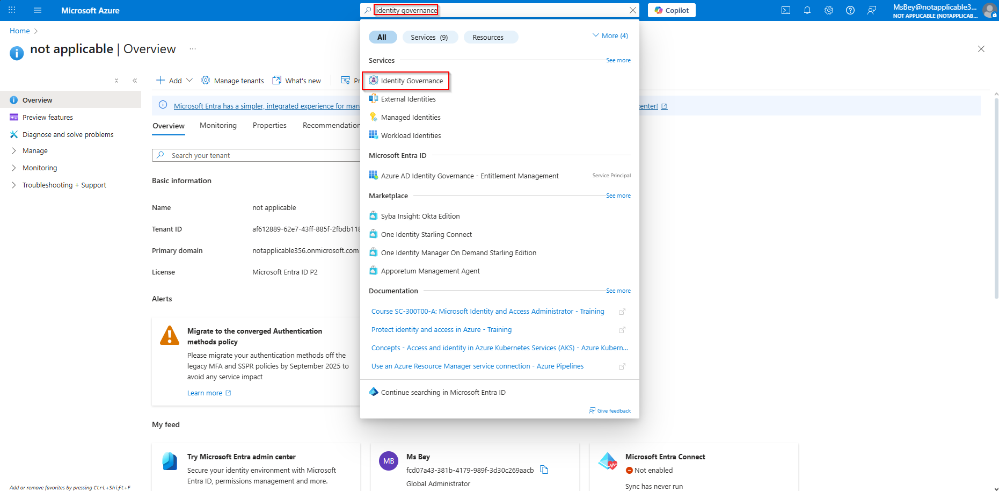  
3. Select **Catalogs** under the Catalogs drop down menu, then click on **+ New Catalog**.
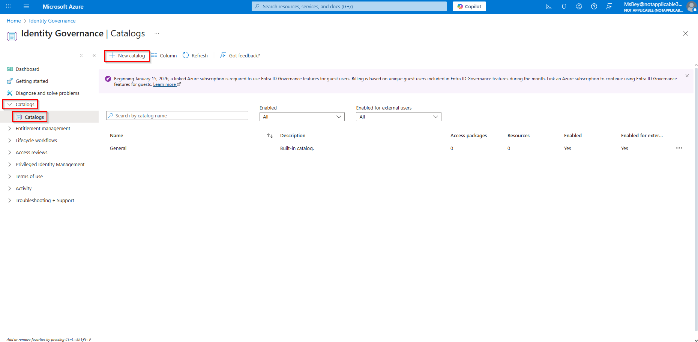
4. Fill in the following boxes, and make the following selections:  
   - **Name:** `Demo`  
   - **Description:** `Demo`  
   - **Enabled:** Yes  
   - **Enabled for external users:** No  
   Click **Create**.

   > ✅ A new catalog (named *Demo*) is now available for access packages.  

---

### 2️⃣ Create an Access Package
1. Under **Entitlement Management** drop down menu, select **Access Packages**. Select **+ New Access Package**. This takes you to the **Basics** section.

2. In **Basics**, enter:
   - **Name:** `DemoAccessPackage`
   - **Description:** `DemoAccessPackage`
   - **Catalog:** Select `Demo`  
3. Click **Next → Resource Roles**.
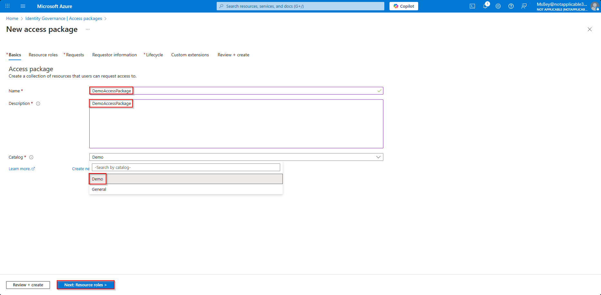

---

### 3️⃣ Add Resources to the Access Package
1. On **Resource Roles**, select **+ Groups and Teams**.
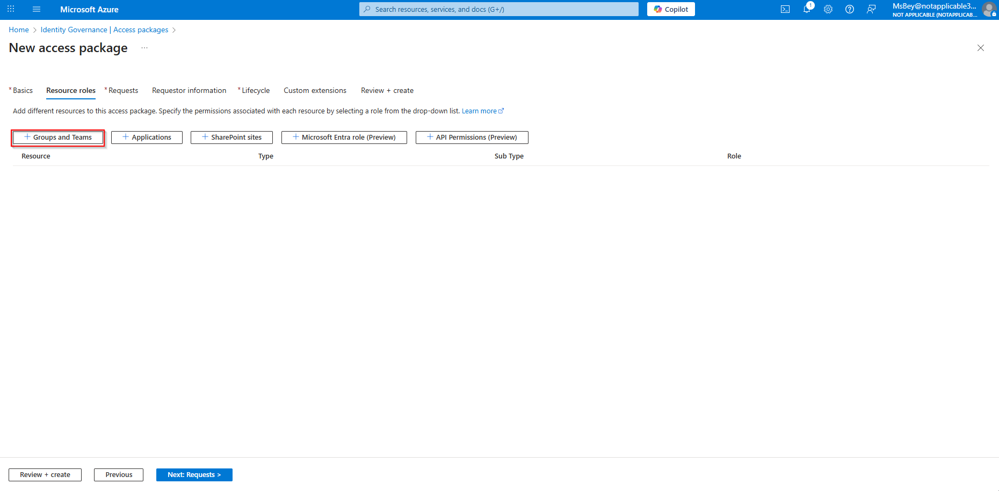
2. Enable the toggle to *See all Group and Team(s) not in the 'Demo' catalog.* Choose a group (e.g., `Project23`) and click Select.
 
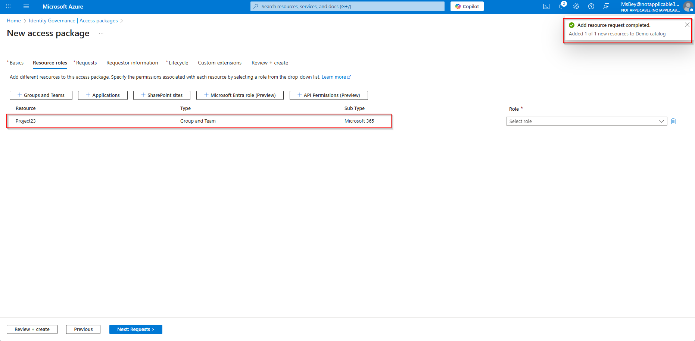
3. Choose **Role:** `Member`. Then click **Next: Requests >**.
 
4. Add **Applications**:
   - Toggle on *See all Group and Team(s) not in the 'Demo' catalog.*  
   - Select Enterprise Applications (e.g., `Microsoft Graph Command Line Tool`), then click **Select**

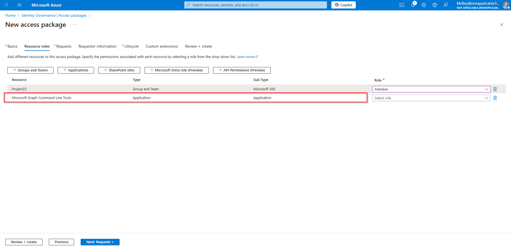   
   - Assign appropriate roles (`Default Access`).
 
5. Review that the listed resources include both group(s) and app(s).  
6. Click **Next: Requests >**.

---

### 4️⃣ Define Who Can Request Access
1. In **Who can get access**, choose:  
   - **For users, service principals, and agent identities in your directory:** ✅ Enabled.  
2. Under **Select specific scope**, select: **All members (excluding guests)**.    
3. **Who can request access:** Admin (selected by default; optional to select Manager additionally).
4. **Requires approval:** Yes.  
5. **Require requestor justification:** Yes.
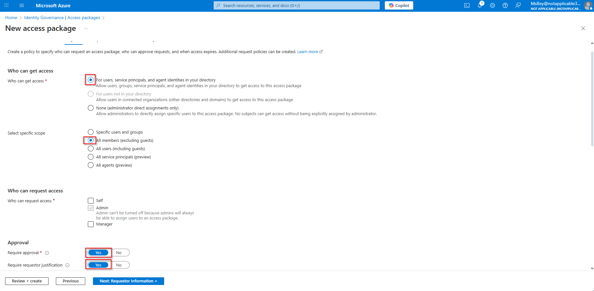
6. **How many stages:** 1
7. **Add fallback:** Select an admin or security officer account (e.g. Ms Bey); then click Select.

8. **Decision duration:** 14 days.
9. **Require approver justification:** No
10. Under **Email Notifications**, **Disable assignment emails:** No
11. Click **Next: Requester Information >**.
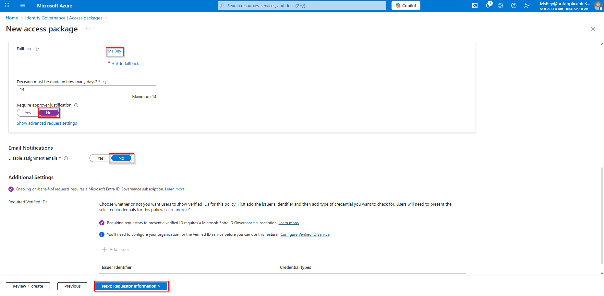

---

### 5️⃣ Requester Information (Optional)
- Skip custom questions unless you need to collect attributes from the requester.
  
- Click **Next: Lifecycle >**.

---

### 6️⃣ Configure Expiration and Lifecycle Policies
1. In **Expiration**, set **Access package assignments expires** to **Number of days**, and **Assignments expire after (number of days)** to 365 (1 year).  
2. Enable **Users can request specific timeline** by selecting Yes 
3. Enable **Access Reviews:** by clicking the check ✅ box.  
4. Set review details:
   - **Sarting on:** Choose desired start (eg. 12/05/2025).  
   - **Review frequency:** Annually.  
   - **Duration (in days):** e.g., 360 days.  
   - **Reviewers:** Manager.  
   - **Select fallback reviews:** Admin or IAM Lead (e.g. Ms Bey); then click Select
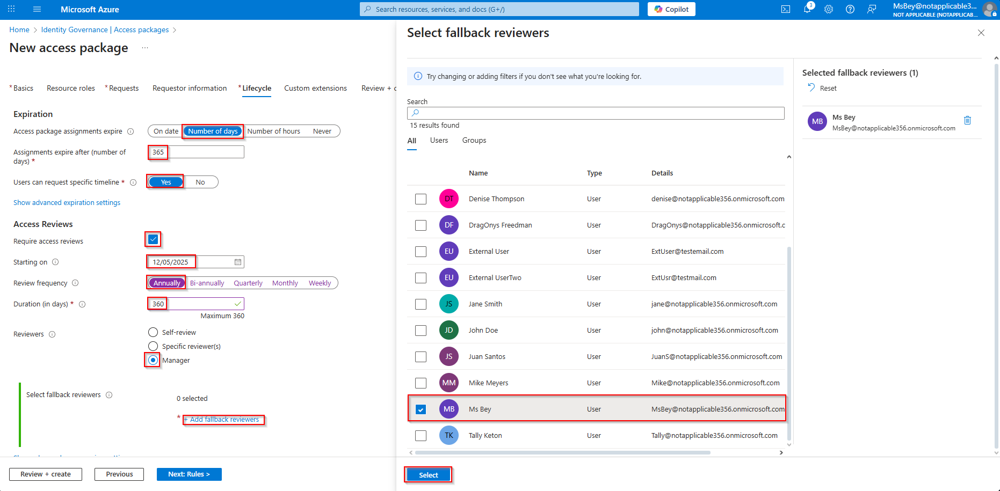  
5. Click **Next: Rules >**.

6. You can skip setting up Custom Extensions and click **Next: Review + create >**

---

### 7️⃣ Review and Create
Verify the summary page shows: 

Basics
- Name = DemoAccessPackage
- Description = DemoAccessPackage
- Catalog Name = Demo 

Resource roles
- Resource (Project23; Microsoft Graph Command Line Tools)  
- Type (Group and Team; Application) 
- Sub Type (Microsoft 365 Group; Application) 
- Role (Member; Default Access) 

Requests
- Who can get access = All members (excluding guests
- Who can request access = Admin
- Require approval = Yes
- Disable assignment emails = No
- Enabled = Yes
- Require requestor justification = Yes
- How many stages = 1 

First Approver
- Approvers = Manager as approver ; Fallback(Ms Bey)
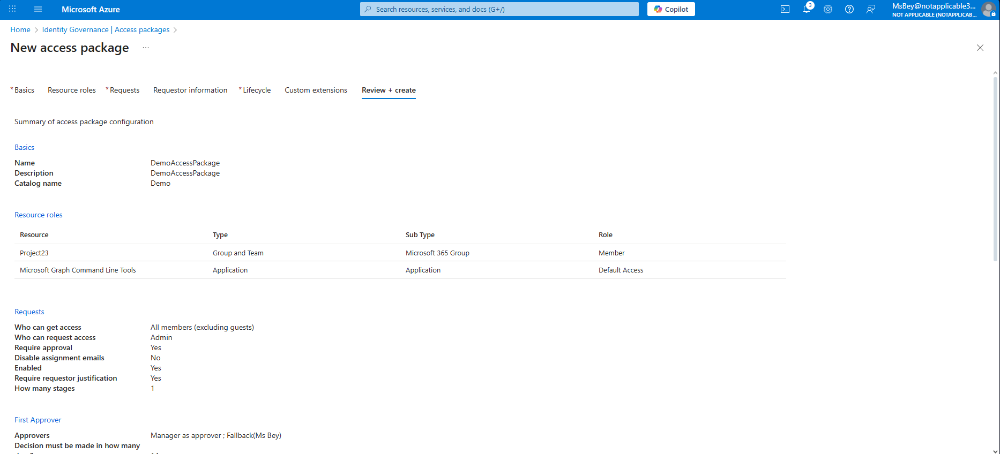
- Decision must be made in how many days? = 14
- Require approver justification = No
- Show approvers details to requestors (preview) = Default
- If no action taken, forward to alternate approvers? = No 

Lifecycle
- Access package assignments expire = After 365 days
- Require access reviews = Yes
- Starting on = 12/5/2025
- Review frequency = Annually
- Duration (in days) = 360
- Reviewers = Manager
- Fallback reviewers = Ms Bey
- If reviewers don't respond = No change
- Show reviewer decision helpers = Yes
- Require reviewer justification = Yes 

Click **Create**.
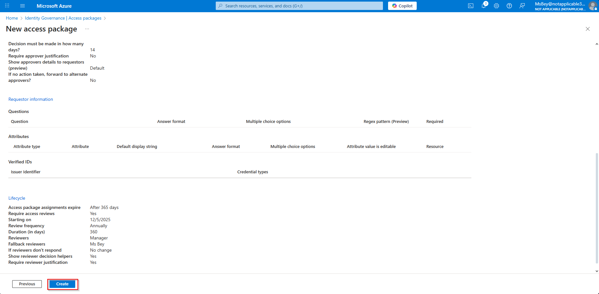
  
> ✅ The Access Package is provisioned and available in your tenant.  
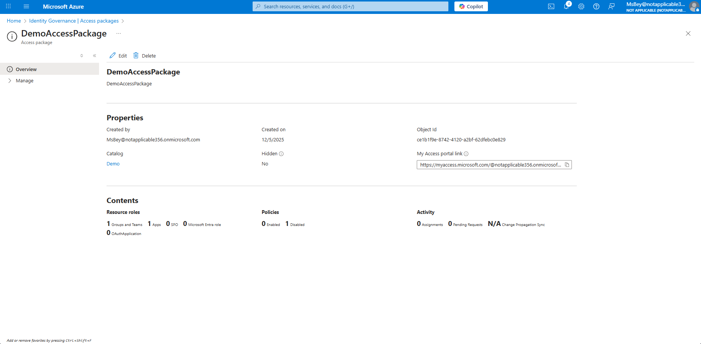

---

## ✅ Conclusion
This lab provided comprehensive hands-on experience with configuring and managing Access Packages within Microsoft Entra ID (Azure AD) to simulate full identity lifecycle governance. We created a catalog, built an access package, and defined governance workflows for user requests, approvals, and role assignments across groups and enterprise applications. Expiration and access review policies were implemented to automate user offboarding and maintain compliance. Overall, this lab demonstrated practical, real-world skills required to govern user access at scale — aligning identity management with policy‑driven security and lifecycle automation best practices.  

---

**Author:** *Qadriyyah Abdullah [Ms Bey]*  
**Date:** *December 2025*  
**Tags:** `SC‑300` `AzureAD` `Microsoft Entra ID` `IdentityGovernance` `AccessPackages` `LifecycleManagement`
