# 📄 Building Audit‑Style Reports in Microsoft Entra ID  
### (GUI and PowerShell Walkthrough for IAM Compliance Simulation)

This lab provides a complete walkthrough for building audit‑style reports in **Microsoft Entra ID**.  
You will collect evidence about:

- User access (roles, groups, applications)  
- Privileged role changes  
- Orphaned, stale, and external accounts  
- Ownership gaps using Microsoft Graph PowerShell  

The goal is to simulate real‑world **IAM compliance**, **access reviews**, and **audit preparation** (SOC 2, ISO 27001, NIST 800‑53, PCI‑DSS, etc.).

---

## 🧭 Prerequisites

You must have one of the following roles:

- Global Administrator  
- Privileged Role Administrator  
- Security Administrator  
- Identity Governance Administrator  

You will also need access to the Entra admin portal:

👉 https://entra.microsoft.com

---

# 🟦 1. Audit User Access (Assigned Roles, Groups, and Applications)

Auditors commonly begin with:  
**“Who has access to what, and how was it granted?”**

This section teaches you how to manually gather user‑level access evidence.

---

## 🔹 1.1 View a User’s Privileged Role Assignments

**Steps**

1. Open **Entra ID → Users → All users**  
2. Select a user  
   
3. In the user profile, select **Assigned roles**  
4. Review and capture a screenshot of all directory role assignments  
   

**Audit Purpose**

- Confirms whether the user holds any privileged or admin roles  
- Differentiates **standing** assignments vs. **eligible** PIM‑controlled roles  
- Supports least‑privilege evaluation  

---

## 🔹 1.2 View a User’s Group Membership

Groups are a major source of **indirect** access.

**Steps**

1. In the same user profile, select **Groups**  
   
2. Capture a screenshot of all security, Microsoft 365, and dynamic groups (if any) 
   

**Why this matters**

Group → Application → Role mappings often provide hidden access paths that are not obvious from user roles alone.

---

## 🔹 1.3 View a User’s Application Assignments

Application assignments identify direct access to SaaS or enterprise apps.

**Steps**

1. Open the user profile  
2. Click **Applications**  
   
3. Capture the list of assigned applications  
   

**Audit Value**

Shows access to applications that may contain sensitive data such as HR systems, finance tools, CRM software, and identity‑integrated apps.

---

# 🟦 2. Audit Role Changes (Who Added or Removed Access?)

Auditors must validate:

- Who granted privileged access  
- Who removed it  
- When the change occurred  
- Whether the action was legitimate  

The **Audit Logs** section enables this review.

---

## 🔹 2.1 Access Audit Logs for Role Management Activity

**Steps**

1. Go to **Entra ID → Monitoring & Health → Audit logs**  
   
2. Under the **Category** filter, select **Role Management**, then click **Apply**  
   
3. The portal now displays all role‑related events (assignments, removals, activations)  
   
4. Capture screenshots for documentation  

---

## 🔹 2.2 Filter Role Audit Logs by User or Event Type

You can narrow audit events to identify specific activity.

**Steps**

1. In **Audit logs**, click **Add filters**  
2. Available filters include:  
   - Initiated by (person who performed the action)  
   - Target (user who received or lost access)  
   - User Agent  
   - Status<br>
  After selecting a filter and the user under investigation, click **Apply**
   
   
   

**Audit Purpose**

- Confirms accountability  
- Tracks unauthorized or excessive privilege assignments  
- Helps validate access‑review results  

---

# 🟦 3. Identify Orphaned Accounts (Stale, Disabled, Guest, Unassigned)

Orphaned accounts represent high‑risk identity gaps because they lack clear ownership or monitoring.

These may include:

- Disabled accounts with active admin roles  
- Stale accounts (no sign‑ins for 90+ days)  
- Guest accounts (`#EXT#`)  
- Unlicensed accounts with privileged access  
- Accounts with no manager assigned  

---

## 🔹 3.1 Find Stale Accounts (No Login in 90+ Days)

**Steps**

1. Go to **Entra ID → Monitoring & Health → Sign‑in logs**  
   
2. Click **Add filter → User**  
   Set **Value = No recent sign‑ins**, then click **Apply**  
   
3. If your tenant has no stale accounts, the results will appear empty  
   
4. Capture evidence for the audit

**Why auditors check this**

Inactive accounts can be exploited by attackers or overlooked during access‑reviews.

---

## 🔹 3.2 Identify Disabled Accounts

Disabled accounts should not retain access, especially administrative roles.

**Steps**

1. Go to **Entra ID → Users → All users**  
2. Click **Add filter** then select **Account enabled** 
   
3. Set the **Account enabled** filter to **No**, then click **Apply**  
   
4. Review the resulting list  
   

**Audit Value**

Disabled accounts with roles or licenses are a common audit failure and require immediate remediation.

---

## 🔹 3.3 Identify Guest or External Users With Access

Guest accounts require extra scrutiny due to third‑party risk.

**Steps**

1. Go to **Entra ID → Users → All users → Add filter → User type**  
   
2. Enter **Guest** as the filter value and click **Apply**  
   
3. Capture results  
   

**Audit Purpose**

Confirms that external identities are tracked, justified, and not over‑privileged.

---

### 🔹 3.4 Find Accounts With No Assigned Manager (Orphaned Ownership)

Accounts without assigned managers represent **ownership gaps**—a major finding during audits.  
This section uses **Microsoft Graph PowerShell** inside **Azure CloudShell** to identify:

- Accounts with no manager  
- Orphaned privileged accounts  
- A full user‑to‑manager mapping report  

---

## **Steps**

### **1. Open Azure CloudShell** 
1.Log in to https://portal.azure.com using an administrator account.
2. Click the **CloudShell (PowerShell) icon** in the top navigation bar to launch the shell.


CloudShell provides a preconfigured environment with all required permissions to run Graph PowerShell commands.

---

### **2. Install the Microsoft Graph PowerShell Module**

The Microsoft Graph module contains cmdlets used to query and manage Microsoft Entra ID (Azure AD).

Run the following command:


```powershell
   Install-Module Microsoft.Graph -Scope CurrentUser -Force
   ```
This installs the module for the current CloudShell user.

---

### 3. Import the Module and Connect to Microsoft Graph

Before querying data, you must load the module and authenticate with the proper permissions.


-   **Import the module:**
      ```powershell
      Import-Module Microsoft.Graph
      ```
-   **Connect with the required permissions:**
     ```powershell
      Connect-MgGraph -Scopes "User.ReadWrite.All"
      ```
---

### **4. Authenticate Using the Device Login Prompt**

When connecting to Microsoft Graph, CloudShell will display a message instructing you to authenticate; for example:

**To sign in, use a web browser to open https://microsoft.com/devicelogin and enter the code B426889U2l**

Follow these steps:

1. Open **https://microsoft.com/devicelogin** in your browser.  
2. Enter the **authentication code** shown in CloudShell.  
3. Sign in using your **Global Administrator** account.  
4. Approve the **MFA prompt** on your mobile device.  
5. Confirm the permissions request for **Microsoft Graph Command Line Tools**.  
6. Once authentication completes, you may **close the browser tab** and return to CloudShell.

**Screenshots from the lab:**  
  
  
  
  


After successful login, CloudShell shows a welcome message:


--- 

### **5. Generate a Report of All Users and Their Managers**

Run the following command to collect all users, their basic account properties, and their assigned managers.  
This creates a structured dataset that includes:

- Display name  
- User principal name (UPN) 
- Account enabled/disabled status  
- Manager name (blank if no manager is assigned)

   ```powershell
   $report = Get-MgUser -All -Property "id,displayName,userPrincipalName,accountEnabled" |
   Select-Object DisplayName,UserPrincipalName,AccountEnabled,
   @{Name='Manager';Expression={(Get-MgUserManager -UserId $_.Id -ErrorAction SilentlyContinue).DisplayName}}<br>
   ```
## 6. Filter for Orphaned Accounts (No Manager Assigned)
Run:

   ```powershell
   $orphans = $report | Where-Object { -not $_.Manager }
   ```
This identifies users with no assigned manager.

---

**OPTIONAL**:  Identify Orphaned Accounts With Privileged Roles
   ```powershell
   $roles = Get-MgDirectoryRole
foreach ($role in $roles) {
  $members = Get-MgDirectoryRoleMember -DirectoryRoleId $role.Id
  foreach ($m in $members) {
    $match = $orphans | Where-Object { $_.UserPrincipalName -eq (Get-MgUser -UserId $m.Id).UserPrincipalName }
    if ($match) { $match | Add-Member -NotePropertyName "PrivilegedRole" -NotePropertyValue $role.DisplayName }
  }
}
```
This is extremely valuable during audits, as privilege without ownership is a critical finding.

---

## 7. Validate the Data Collection
Use the `Measure-Object` cmdlet to count how many users were retrieved in the `$report` variable, then use the `Select-Object` cmdlet to display the first five user records from the `$report` variable.  

```powershell
$report | Measure-Object
```
This confirms that the Graph query executed correctly.

---

## 8. Count Orphaned Accounts
Count orphans.

```powershell
$orphans | Measure-Object
```
In this lab, 14 orphaned accounts were identified.

---

## 9. Display All Accounts Missing Managers
This command shows only DisplayName and UPN to simplify review:

```powershell
$report | Where-Object { -not $_.Manager } | Select-Object DisplayName,UserPrincipalName
```
## 10. Export Orphaned Accounts to CSV
Export the report for audit documentation:

   - **Export the orphaned accounts to a CSV file:**
     ```powershell
       $orphans | Export-Csv "OrphanedAccountsReport.csv" -NoTypeInformation
       ```
   - **Check the current directory to confirm where the file was saved:**
     ```powershell
       Get-Location
       ```
   - **List all CSV files in the directory to verify the export:**
     ```powershell
       Get-ChildItem *.csv
       ```
   - **Open the report to review the contents:**
     ```powershell
       view OrphanedAccountsReport.csv
       ```


**Audit Value:**  
Accounts without a manager lack defined ownership and oversight, making them one of the highest‑priority findings in IAM audits.
This evidence is used to:

Identify responsibility gaps
Support access certification
Validate HR integration accuracy
Flag accounts that may require immediate remediation

---

## 🟦 4. Exportable Built‑In Reports (Evidence for Auditors)

Microsoft Entra provides several built‑in reports that can be exported in CSV format.  
These files serve as **direct evidence** for auditors and support teams performing access reviews, compliance checks, or role‑based investigations.

---

### 🔹 4.1 Export Role Assignments

This report shows *who is assigned to each privileged or standard role*, which is one of the most commonly requested audit artifacts.

**Steps**

1. Navigate to **Entra ID → Roles & administrators**, then click the role you want to export.  
   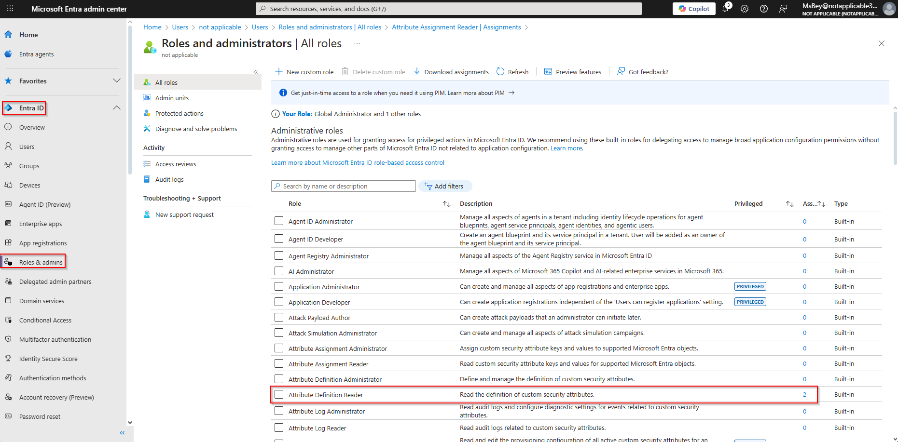

2. Click **Export** on the top menu.  
   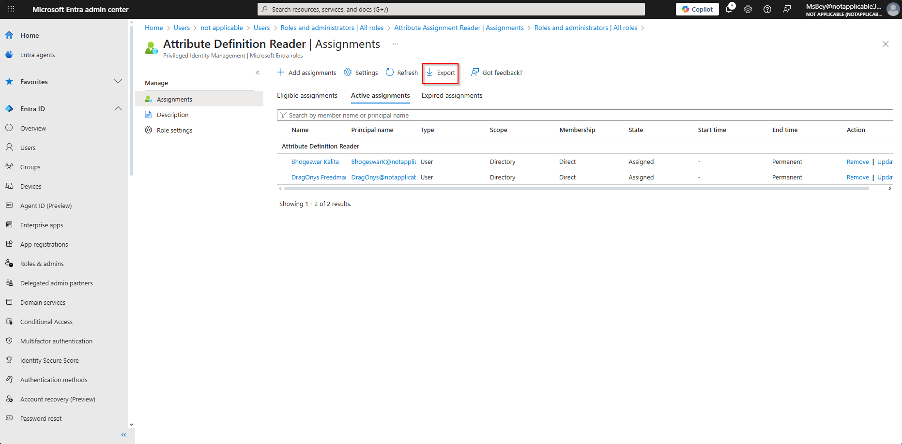

3. Select **Download** to generate the CSV.  
   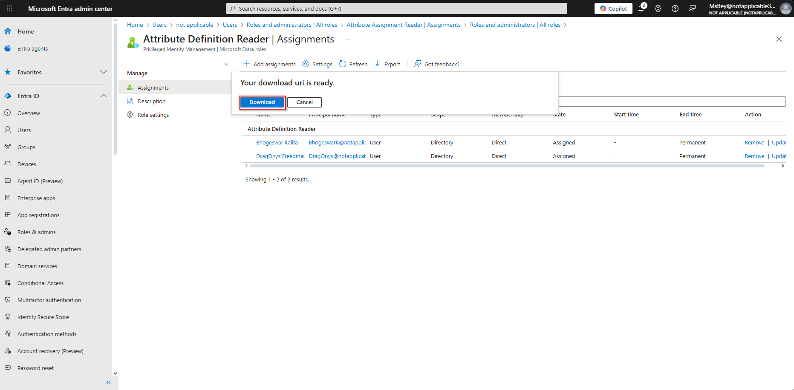

4. The report will download to your local machine and can be submitted directly as audit evidence.  
   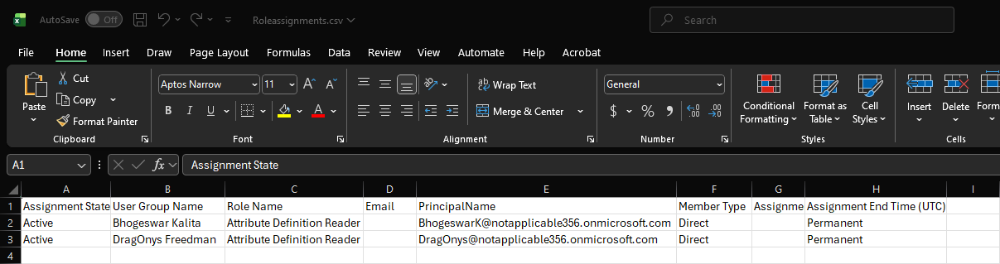

**Audit Value:**  
This provides a complete list of users who hold privileged or sensitive roles and is often required during SOC 2, ISO 27001, and internal access-certification reviews.

---

### 🔹 4.2 Export Sign‑in Logs

Sign‑in logs provide visibility into *authentication activity*, failed login attempts, MFA usage, and anomalous behavior.

**Steps**

1. Go to **Entra ID → Monitoring → Sign‑in logs**.  
   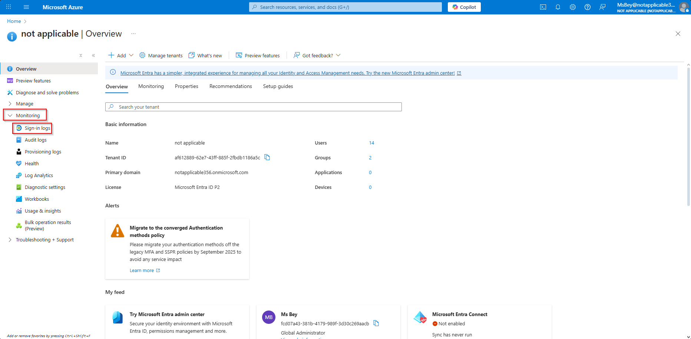

2. Click **Download → Download CSV**.  
   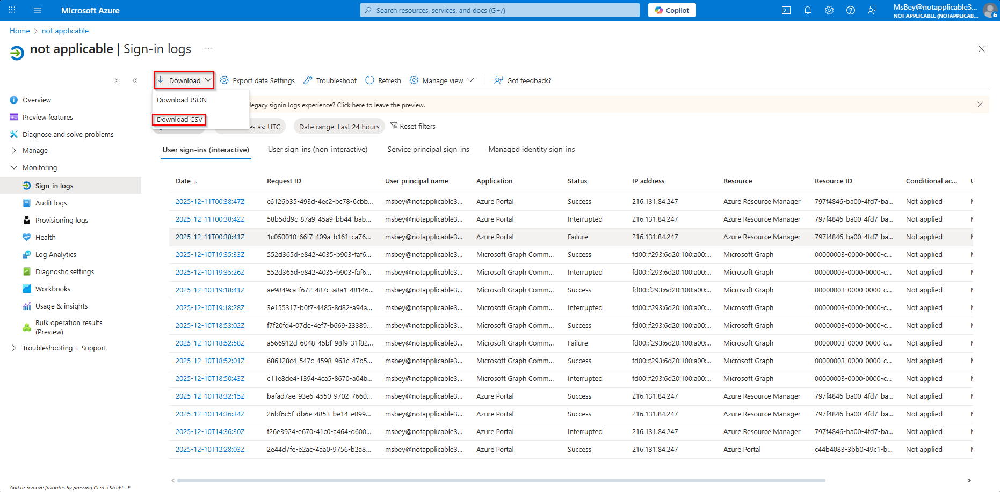

3. Choose one or more log files to export based on your filter settings or audit requirements.  
   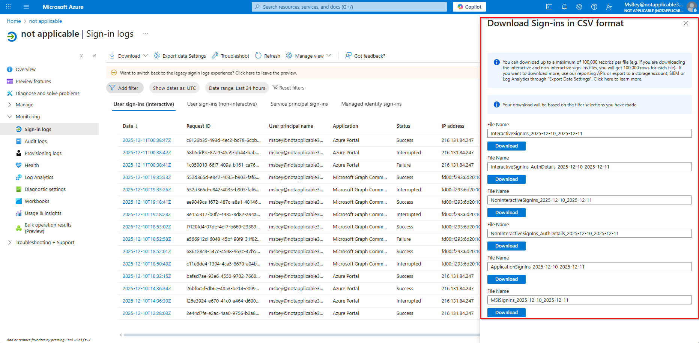

4. Your sign‑in logs will be downloaded to the local machine.  
     
   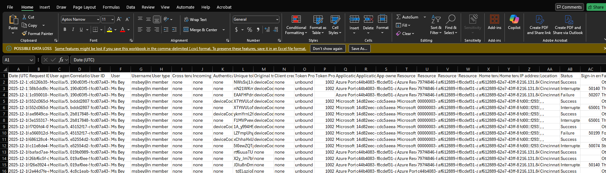

**Audit Value:**  
Sign‑in logs help verify user activity, detect anomalies, and demonstrate authentication controls during compliance reviews.

---

### 🔹 4.3 Export Directory Audit Logs

Directory audit logs track **changes to users, roles, groups, and configurations**—all critical for compliance and forensic investigations.

**Steps**

1. Navigate to **Monitoring → Audit Logs**.  
   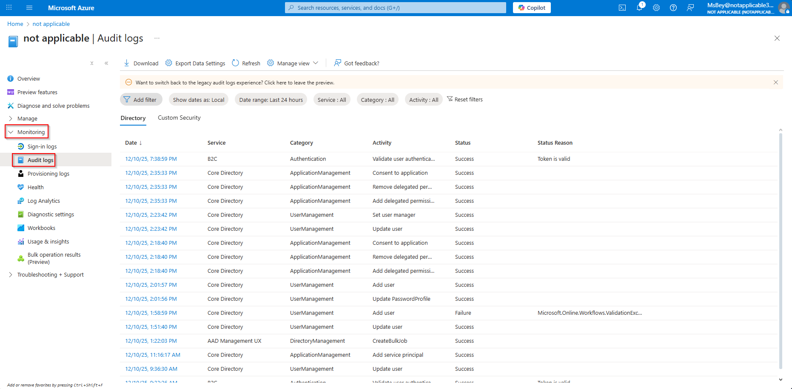

2. Click **Download**, and when the download panel appears on the right, select:  
   - **Format:** CSV  
   - **File Name:** Provide a descriptive name  
   - Then click **Download**  
   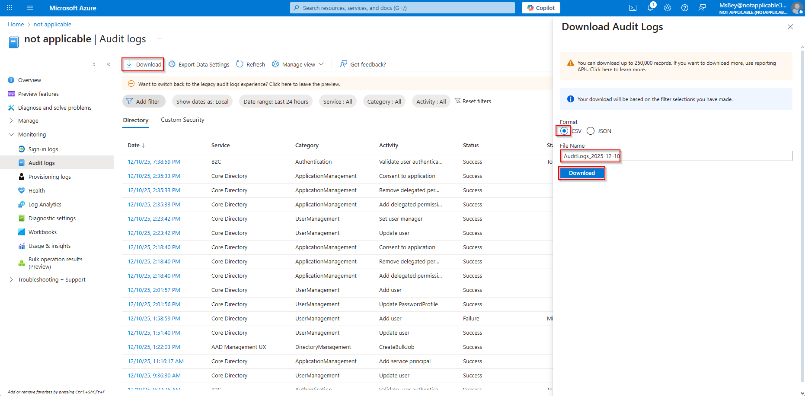

3. The audit log CSV will download to your machine for review or submission to auditors.  
   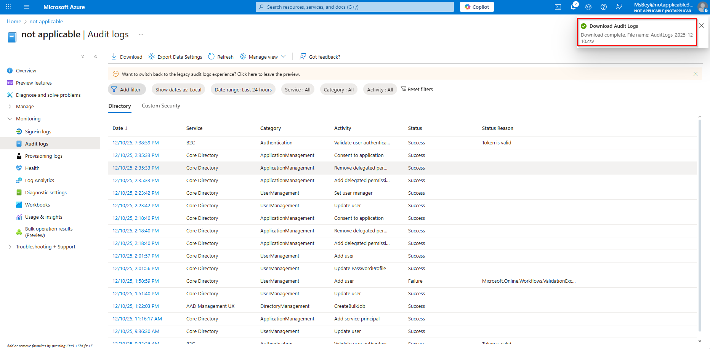  
   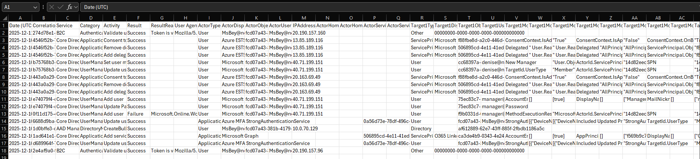

**Audit Value:**  
Audit logs demonstrate change accountability—*who modified what and when*—a key requirement for governance and regulatory frameworks.

---

## 🟦 5. Access Review Evidence (Compliance Simulation)

Most compliance frameworks—including **SOX, SOC 2, ISO 27001, and PCI-DSS**—require periodic access reviews.  
This section demonstrates how to gather evidence that reviews are configured and active.

---

### 🔹 5.1 Navigating Access Reviews

**Steps**

1. Go to **Manage → Identity Governance**.  
   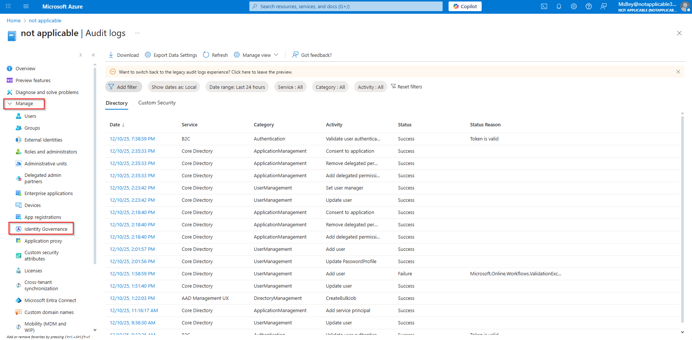

2. Open **Access Reviews → Access Reviews**.  
   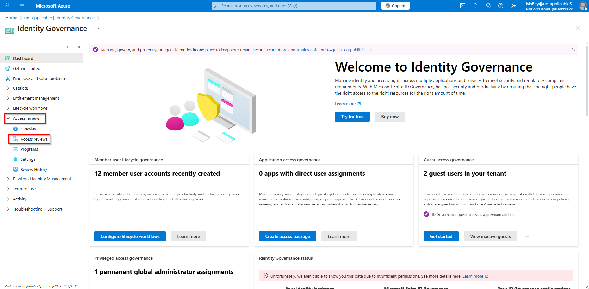

3. Select an existing review to investigate.  
   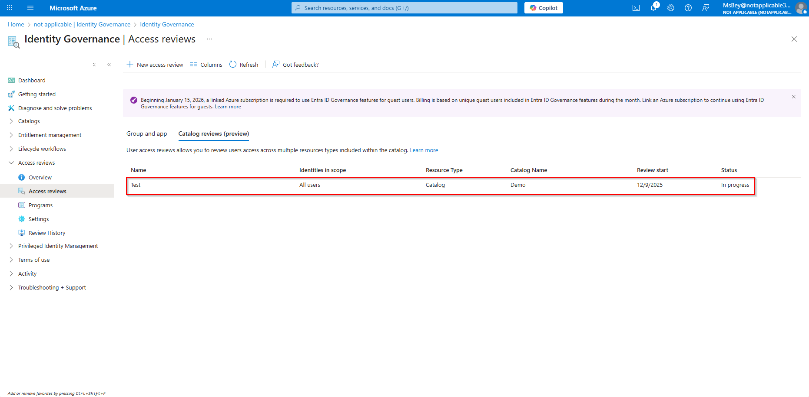

4. Capture the key review properties for audit documentation:  
   - Review name  
   - Object id  
   - Description  
   - Identities in scope  
   - Review series status  
   - Recurrence type
   - Review type
   - Reviewers  
   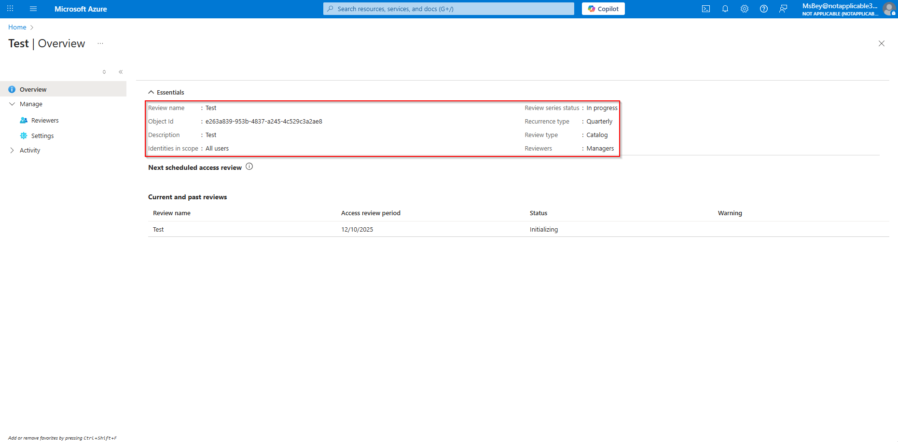

**Audit Value:**  
This demonstrates that your organization has **active governance workflows**, regularly validates access, and tracks attestations—satisfying core compliance requirements.

---

## Conclusion

This lab provided an in‑depth, practical walkthrough of performing access audits within Microsoft Entra ID (formerly Azure Active Directory). You examined user access from multiple angles—directory roles, group memberships, and application assignments—to build a complete picture of how privileges are granted within the environment. You also analyzed role change activity through audit logs, identified orphaned and inactive accounts, and used Microsoft Graph PowerShell to generate detailed reporting on manager assignments and ownership gaps.

By completing this lab, you demonstrated essential IAM analyst and engineer skills, including access review documentation, audit preparation, privilege analysis, and identity lifecycle validation. These are critical competencies for supporting compliance frameworks such as SOC 2, SOX, NIST, and ISO 27001. Overall, this lab showcases your ability to manually collect, interpret, and present identity governance evidence—mirroring the expectations of real enterprise access control audits.

---

**Author:** *Qadriyyah Abdullah [Ms Bey]*  
**Date:** *December 2025*  
**Tags:** `AzureAD` `MicrosoftEntraID` `AccessAudit` `IdentityGovernance` `PrivilegedAccess` `ComplianceReporting`
