# 🔐 Enabling Okta Verify MFA, Enrollment Policies, and Sign‑On Enforcement  
*A Complete IAM Analyst Walkthrough*

This lab demonstrates how to properly enable **Okta Verify MFA**, configure **factor enrollment policies**, enforce **MFA requirements through sign‑on policies**, and validate the **end‑user MFA experience**.  
All steps follow real‑world IAM workflows used in enterprise identity programs.

---

# 🟦 1. Enable MFA Factors in Okta

Before enforcing MFA, you must enable the authenticators users are allowed to enroll.

---

## 🔸 1.1 Navigate to Authenticators

Go to **Security → Authenticators** in the Okta Admin Console.  
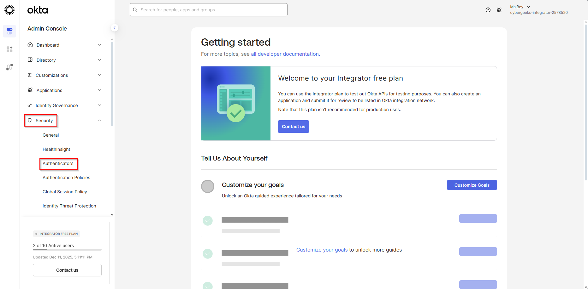

---

## 🔸 1.2 Review Available MFA Authenticators  
You will see built‑in authentication methods such as:

- **Okta Verify** (Push Notification + TOTP)
- **Google Authenticator** (TOTP)
- **SMS Authentication** (One‑time codes)
- **Security Key / WebAuthn** (FIDO2, biometrics)

These can be enabled depending on business requirements.

---

## 🔸 1.3 Add or Configure an Authenticator

If an authenticator is missing, click **Add Authenticator**.  
Otherwise, edit the one you want to configure.

---

## 🔸 1.4 Configure Okta Verify

1. Under Okta Verify, click **Actions → Edit**  
   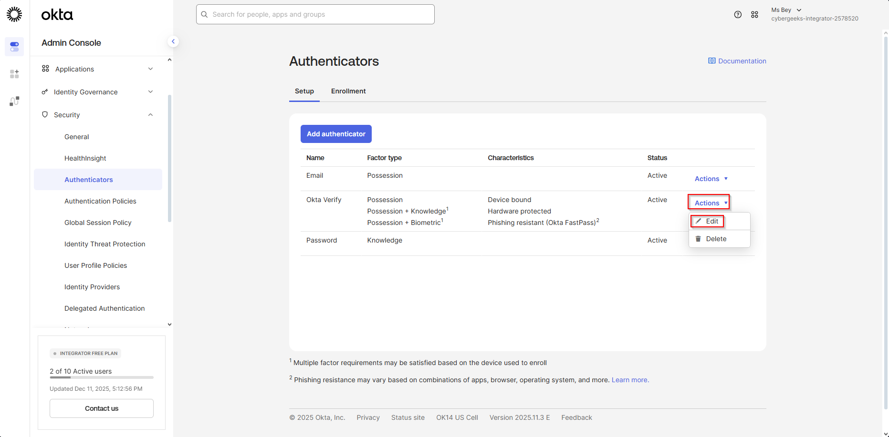

2. Enable the following options:
   - **Push notification**
   - **TOTP (6‑digit codes)**
   - Optional: **Number challenge** (recommended for phishing‑resistance)

   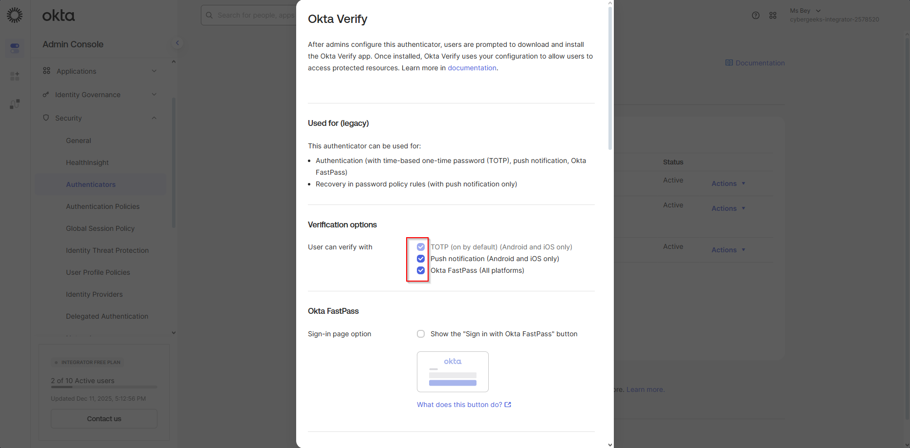

3. Click **Save**  
   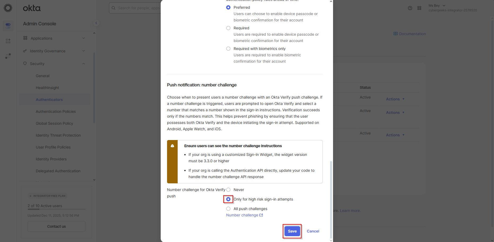

---

## 🛡️ Why This Matters (Real‑World Importance)

Enabling MFA authenticators is the foundation of modern identity security.  
Organizations must:

- Provide **multiple MFA factors** for resilience  
- Support secure authentication methods (e.g., Okta Verify Push)  
- Reduce account compromise risk by eliminating SMS‑only MFA  
- Strengthen defenses against phishing via number‑matching & FIDO2  

This step aligns directly with Zero Trust principles and compliance frameworks such as **SOC 2, ISO 27001, PCI‑DSS**, and **NIST 800‑63**.

---

# 🟦 2. Create an MFA Enrollment Policy

Enrollment policies determine which MFA factors users must enroll in before accessing apps.

---

## 🔸 2.1 Navigate to Enrollment Policies

Go to **Security → Authenticators**, then select the **Enrollment** tab.  
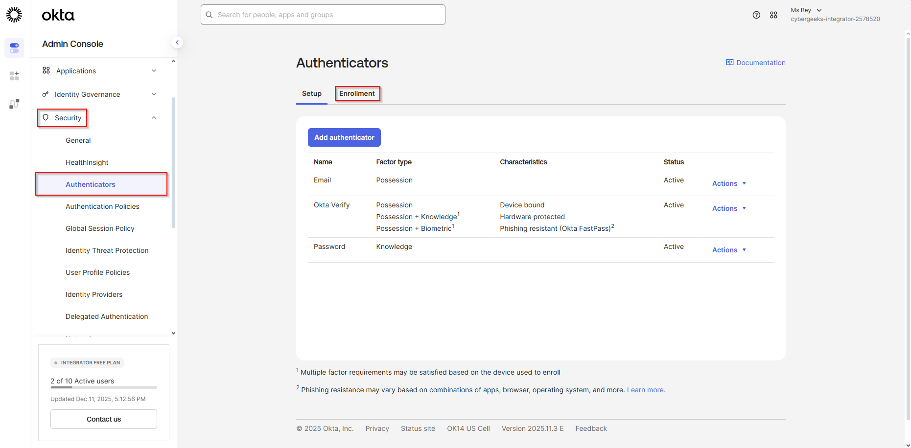

---

## 🔸 2.2 Add a New Enrollment Policy

Click **Add a Policy**.  
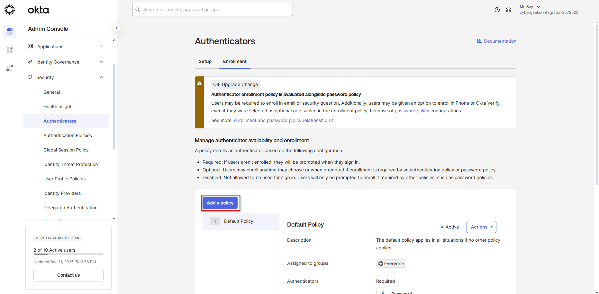

---

## 🔸 2.3 Configure the Enrollment Policy

1. **Name:** `All Users MFA Policy`  
2. Under **Assign to groups**, select:
   - `Everyone`  
   - or specific organizational groups  
3. For each authenticator, select:
   - **Required** – must enroll  
   - **Optional** – user may enroll  
   - **Disabled** – not available  
4. Optional: Set **Grace Period → By a due date**  

5. Click **Create Policy**  
   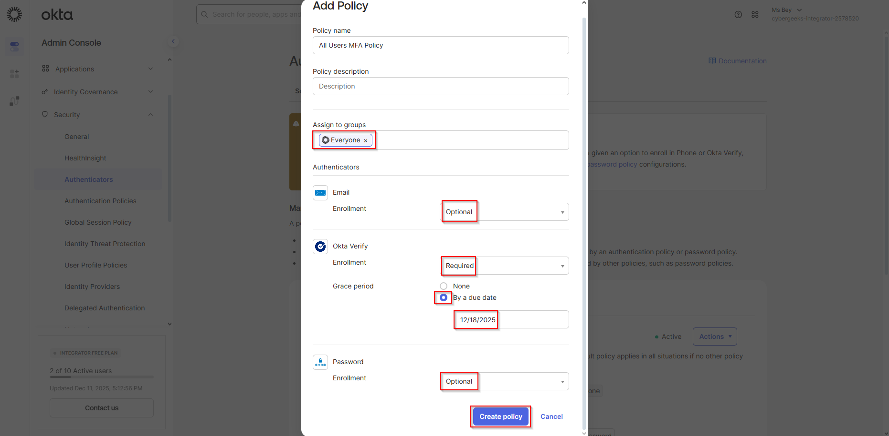

---

## 🛡️ Why This Matters (Real‑World Importance)

MFA enrollment policies ensure users **cannot access resources until they enroll required factors**, which:

- Standardizes MFA adoption across the organization  
- Reduces security gaps from unenrolled users  
- Ensures new hires enroll MFA on first login  
- Enforces compliance‑driven MFA requirements  

IAM teams rely on enrollment policies to ensure *consistent identity hygiene across all user populations*.

---

# 🟦 3. Create a Sign‑On Policy That Requires MFA

Sign‑on policies specify **when** users must authenticate with MFA (new device, each login, high‑risk context, etc.).

---

## 🔸 3.1 Navigate to Authentication Policies

Go to **Security → Authentication Policies**.

---

## 🔸 3.2 Select “App sign‑in”  
Click **App sign‑in**.  
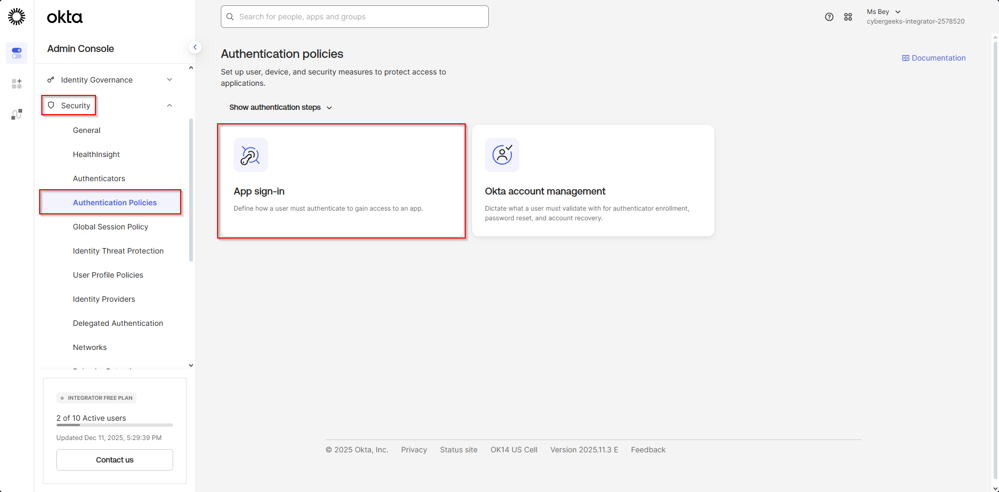

---

## 🔸 3.3 Create a New Authentication Policy

Click **Create policy** in the upper‑right corner.  
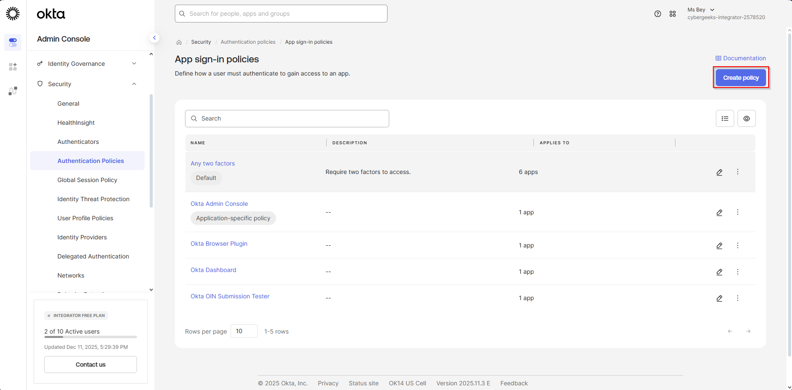

Name the policy:  
**Require MFA for All Apps**  
Then click **Create policy**.  
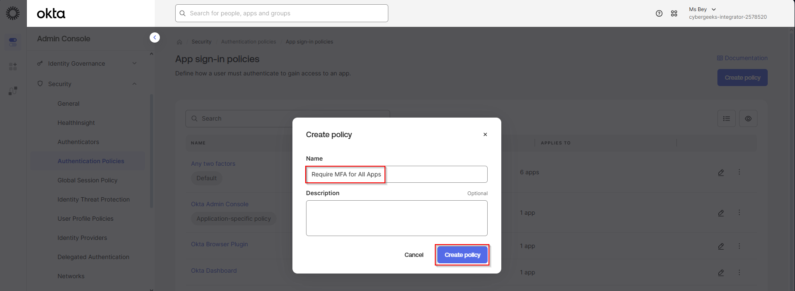

---

## 🔸 3.4 Add an MFA Rule

Click **Add rule**.  
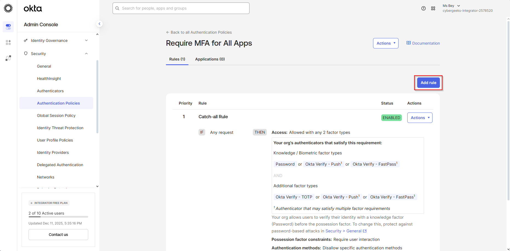

Configure the rule:

- **Rule name:** Always require MFA  
- IF user is: **Any user**  
- AND device is: **Any device**  
- THEN access is: **Allowed after successful authentication**  
- **Re‑authentication:** Every sign‑in attempt  

Click **Save**.  
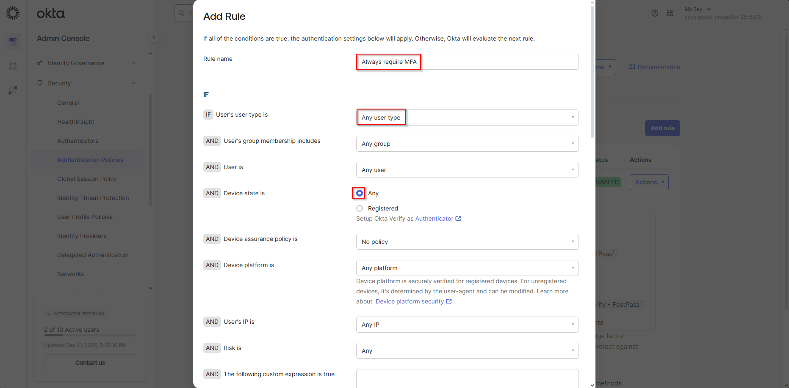  
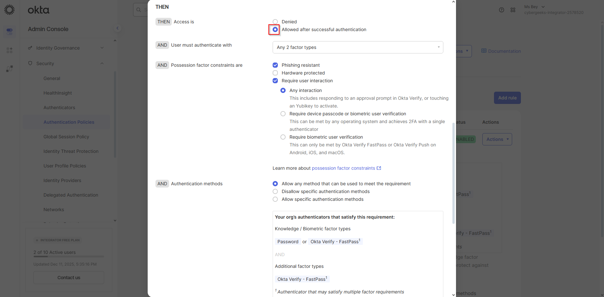  
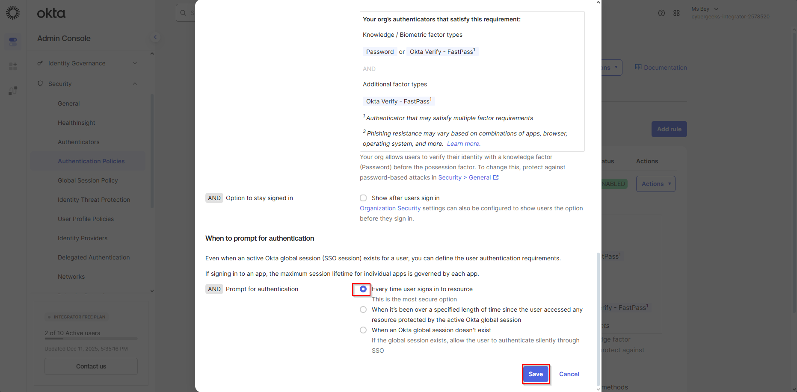

---

## 🔸 3.5 Assign Applications

Under **Applications**, add one or more applications that should use this policy.  
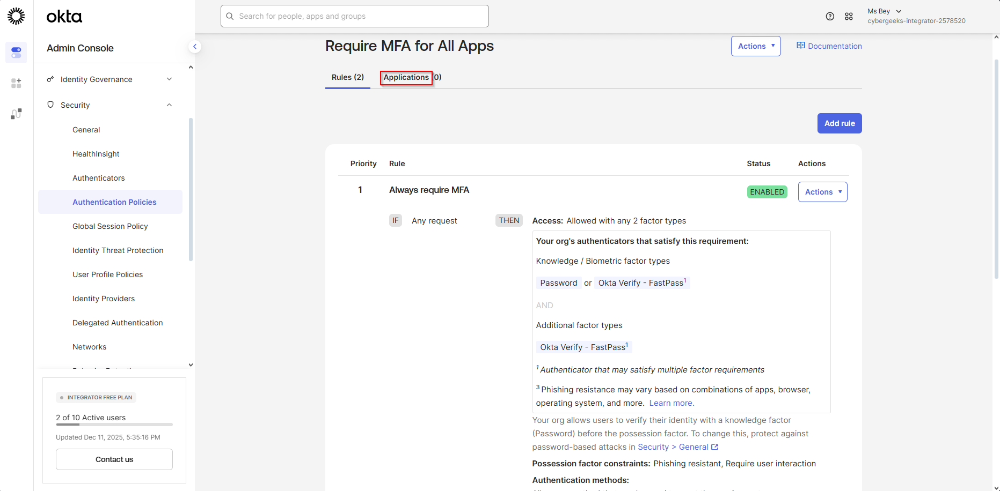  
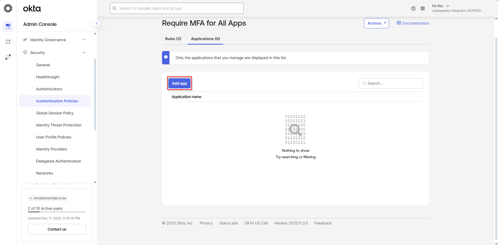  
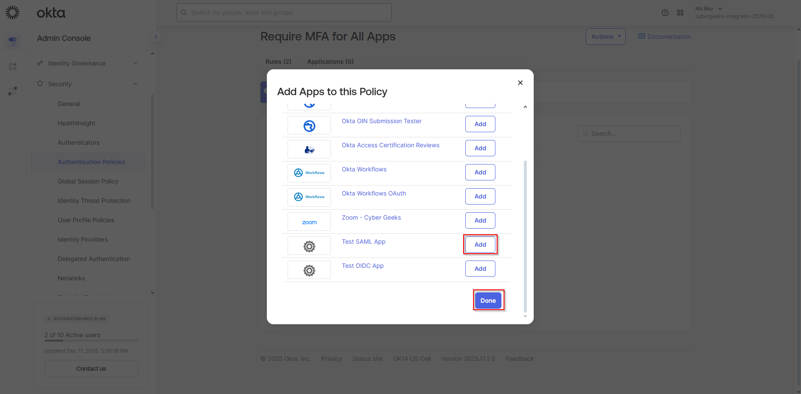

---

## 🔸 3.6 Activate the Policy

Click **Done**, then verify the policy appears in the list.  
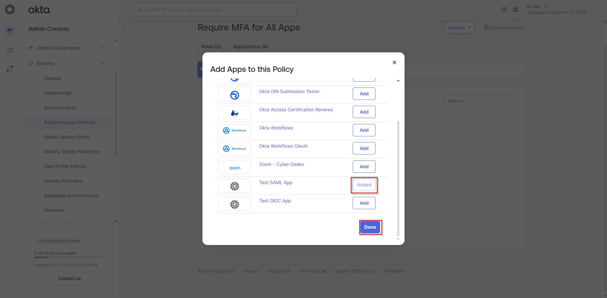  
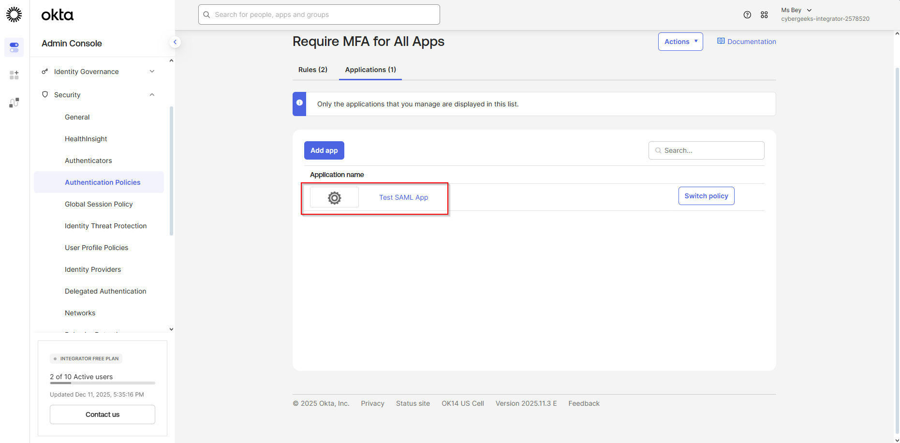

---

## 🛡️ Why This Matters (Real‑World Importance)

Sign‑on policies enforce *context‑based authentication requirements*, helping organizations:

- Protect applications containing sensitive data  
- Prevent unauthorized access  
- Enforce MFA every login or based on risk  
- Segregate access requirements by user group  

IAM analysts engineer these policies to support Zero Trust and MFA‑by‑default security models.

---

# 🟦 4. User MFA Enrollment Experience

End‑user experience must be tested to validate the policy enforcement works as intended.

---

## 🔸 4.1 User Logs In

Use an **incognito window** to simulate a new session.  
User enters their username.  
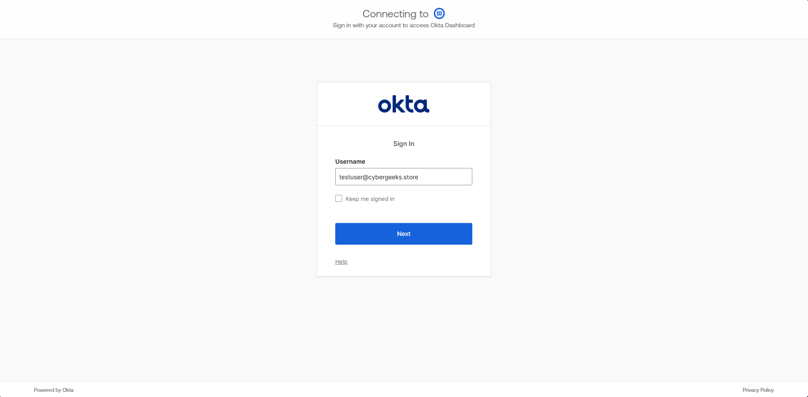

---

## 🔸 4.2 User Is Prompted to Enroll MFA

If MFA is required and not yet enrolled, Okta prompts for MFA enrollment.

---

## 🔸 4.3 User Chooses an Authenticator

Users can choose from available options (Push, code entry, password, etc.).  
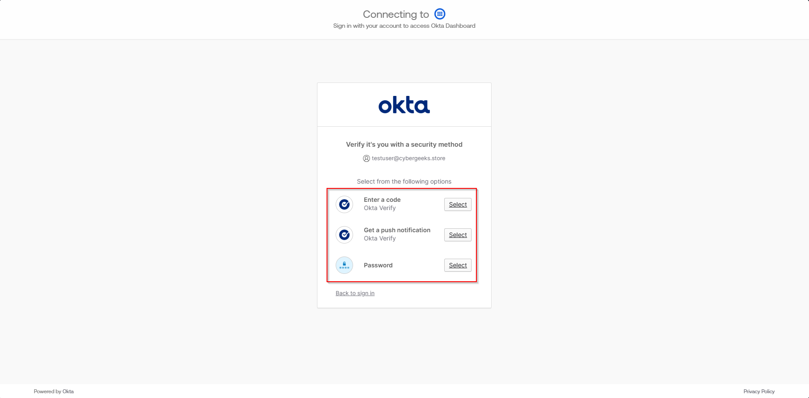

---

## 🔸 4.4 Enroll Okta Verify

Steps:

1. Install **Okta Verify** on mobile  
2. Tap **Add Account**  
3. Scan QR code  
4. Enter 6‑digit passcode  

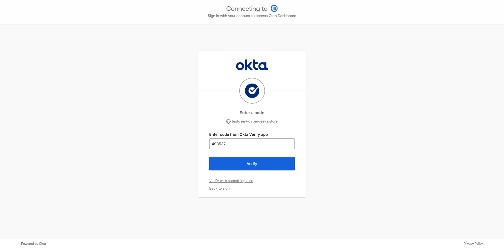

Then choose a **second authentication method** (password used in this lab).  
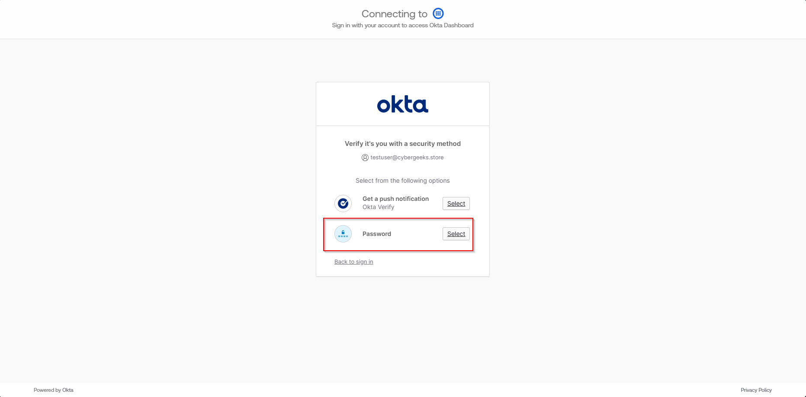  
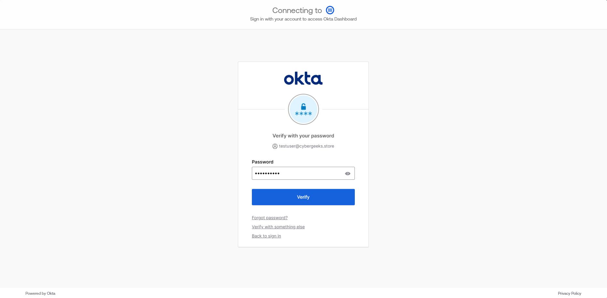

User should now be authenticated successfully:  
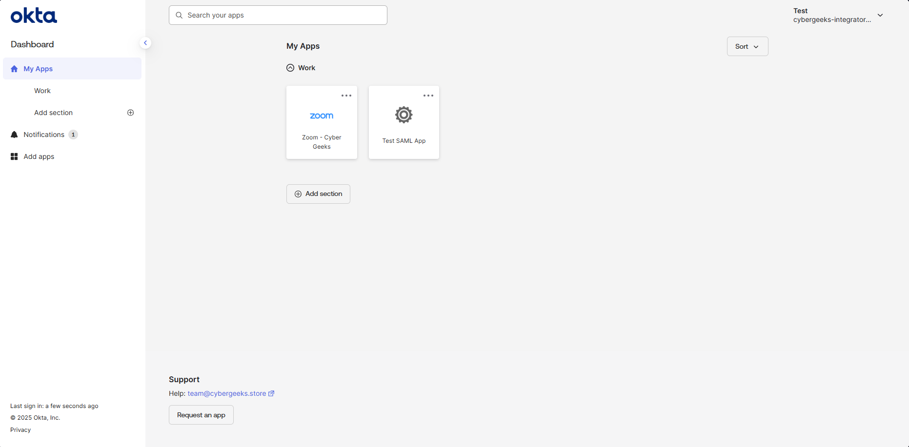

---

## 🔸 4.5 Optional: Enroll TOTP via Google Authenticator

(Not demonstrated in this lab)

Steps:

- Scan QR code  
- Enter TOTP code  
- Use code on future logins  

---

## 🛡️ Why This Matters (Real‑World Importance)

User testing validates:

- Correct enrollment flows  
- Proper factor availability  
- MFA rules working as expected  
- Smooth user experience  

IAM teams must ensure MFA enforcement **does not break access** while still meeting security objectives.

---

# 🟦 5. Validate Configuration Using System Logs

System logs confirm whether MFA authentication events occurred successfully.

---

## 🔸 5.1 Navigate to System Logs

Go to **Reports → System Log**.  
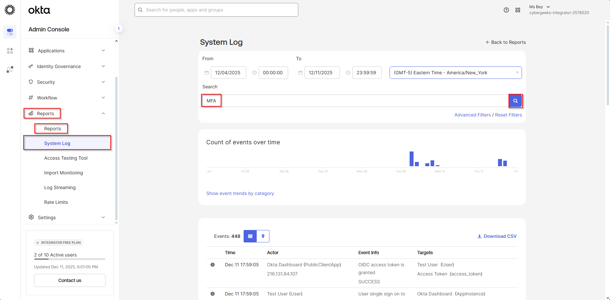

---

## 🔸 5.2 Filter for MFA Events

Search for:  
**"MFA"**, then click the search icon.

---

## 🔸 5.3 Review Event Details

View details such as:

- Which factor was used  
- Who authenticated  
- Success or failure  
- IP address and location  
- Device and client info  

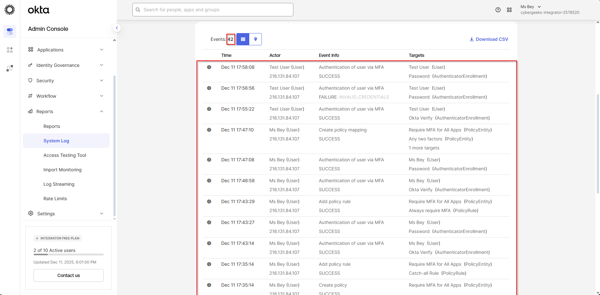

This verifies that policies, enrollment, and authentication requirements are functioning as intended.

---

## ✅ Conclusion

This lab provided comprehensive hands-on experience configuring and enforcing Multi‑Factor Authentication (MFA) using Okta Verify within an enterprise identity environment. You enabled and configured secure authenticators, created MFA enrollment policies, and implemented sign‑on policies that enforce MFA requirements across applications. You also walked through the complete end‑user MFA enrollment experience and validated all authentication events through Okta System Logs.

Overall, this lab demonstrates practical IAM skills essential for strengthening authentication security, enforcing Zero Trust principles, improving organizational compliance posture, and ensuring users authenticate using secure, phishing‑resistant methods. It reflects real-world responsibilities performed by IAM analysts and engineers in modern identity security programs.

---

**Author:** *Qadriyyah Abdullah [Ms Bey]*  
**Date:** *December 2025*  
**Tags:** `Okta` `MFA` `OktaVerify` `AuthenticationPolicies` `IAM` `IdentitySecurity`
