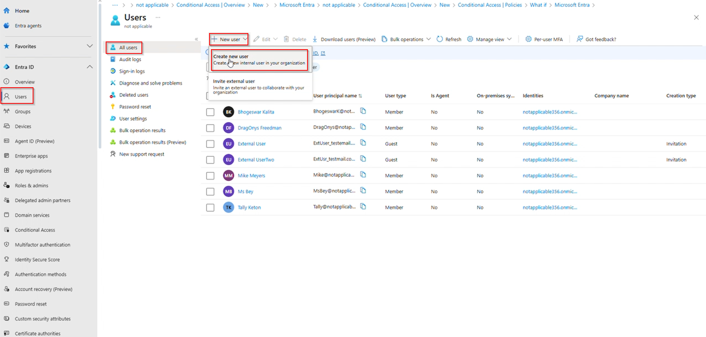

# Azure-Active-Directory

This project documents focus on **managing users, roles, and licenses in Microsoft Entra ID (Azure Active Directory)**.  

The exercises demonstrate identity lifecycle management tasks including user creation, role assignment, bulk import operations, and license administration.

---

## 🧰 Technologies Used
- Microsoft Entra ID (Azure Active Directory)
- Microsoft 365 Admin Center
- Microsoft Graph PowerShell
- Microsoft Excel
- Role-Based Access Control (RBAC)
- Identity Lifecycle Management

---

## 🧠 Key Learning Objectives
- Manage users and directory roles in Entra ID.  
- Apply RBAC and principle of least privilege.  
- Perform bulk user operations using CSV and PowerShell.  
- Assign licenses and verify usage locations.  
- Restore deleted user accounts.

---

# 🧩 Exercise 1 – Add and Test a New User

### **Task 1: Add a New User**
1. After signing in to the [Microsoft Entra admin center](https://entra.microsoft.com) as a **Global Administrator** using Microsoft 365 admin credentials, in the left-hand menu, expand **Entra ID → Users → All Users**, then select **+ New user → Create new user**.

2. Provide the following:
   - **User principal name:** `ChrisG`
   - **Display name:** `Chris Green`
   - Ensure **Auto-generate password** is enabled.  
3. Copy the generated password securely — it's needed for sign-in.
  
4. Select **Review + Create**, then confirm user creation.  


### **Task 2: Sign In as the New User and Attempt App Creation**
1. Open an **InPrivate/Incognito** browser window.  
2. Navigate again to [https://entra.microsoft.com](https://entra.microsoft.com).  
3. Sign in as **Chris Green** using the provided username and password.

 
4. When prompted, update the password:
   - **Current Password:** Auto-generated password  
   - **New Password:** Your secure choice


5. After signing in, use the search bar to locate **Enterprise Applications**.

6. Select **+ New Application** — observe that “Create your own application” is unavailable.


7. Explore settings like **Consent and Permissions** and **User Settings** to verify lack of admin privileges.

8. Sign out from the Chris Green session.


---

# 🧩 Exercise 2 – Assign Role and Create an Application

### **Task 1: Assign Application Administrator Role**
1. As **Administrator** in the Entra admin center, navigate to **Entra ID → Users → All Users → Chris Green**. In the left-hand menu, select **Assigned Roles → + Add Assignments**.

2. Choose the **Application Administrator** role from the dropdown.


3. Under **Assignment Type**, mark **Active**, and use a justification like “Needed for lab.” and select **Assign**.

4. Click **Refresh** to confirm the new role assignment.  


### **Task 2: Verify New Role Permissions**
1. After launching a new In-Private browser session and signing in as **Chris Green** again, return to **Enterprise Applications** via search and confirm that **+ New Application** and **Create your own application** options are now available.


2. Sign out again once verified.

---

# 🧩 Exercise 3 – Remove the Assigned Role

### **Task 1: Remove the Application Administrator Role**
1. After signing in as the **Administrator** again, typing **Roles and Administrators** in the search bar and and opening it, select **Application Administrator** from the list, then on the **Assignments** page, locate **Chris Green**, select the checkbox beside the user, and choose **Remove**.

2. Confirm removal, then close the window.

---

# 🧩 Exercise 4 – Bulk User Creation

### **Task 1: Bulk Creation Using CSV**
1. From Entra ID, navigate to **Identity → Users → All Users**, then select **Bulk Operations → Bulk Create**.

2. Download the provided **CSV template**.

3. Open the file and populate sample user details (e.g., name, username, and department).

4. Save the CSV with your tenant domain (e.g. `user1@notapplicable356.onmicrosoft.com`).  
5. Upload the file back under the **Bulk Create** section and select **Submit**.

6. Confirm successful creation — new users should appear in the user list.


### **Task 2: Bulk Creation Using PowerShell**
1. Ensure **PowerShell version 7.2+** is installed.  
2. Open PowerShell and install the Microsoft Graph module:


   ```powershell
   Install-Module Microsoft.Graph -Scope CurrentUser -Verbose
   Get-InstalledModule Microsoft.Graph
3. Connect to Microsoft Graph (after entering the command, log in with admin email under the link generated in PowerShell, along with the provided code; after successful login, "Welcome to Microsoft Graph!" message appears in PowerShell):


   ```powershell
   Connect-MgGraph -Scopes "User.ReadWrite.All"
4. Define password policy:

   ```powershell
   $PWProfile = @{
    Password = "<Enter-Complex-Password>";
    ForceChangePasswordNextSignIn = $false
   }

5. Create new user and assign role:

   ```powershell
   New-MgUser `
    -DisplayName "Juan Santos" `
    -GivenName "Juan" -Surname "Santos" `
    -MailNickname "JuanS" `
    -UsageLocation "US" `
    -UserPrincipalName "JuanS@notapplicable356.onmicrosoft.com" `
    -PasswordProfile $PWProfile -AccountEnabled `
    -Department "Marketing" -JobTitle "Trainer"

6. Verify user creation:

   ```powershell
   Get-MgUser

# 🧩 Exercise 5 – Remove and Restore Users

### **Task 1 – Delete a User**
1. Navigate to Entra ID → Users → All Users, then select **Chris Green** and choose Delete.

2. Refresh the page to see that Chris Green has been removed from the list.


### **Task 2 – Restore Deleted User**
1. From the side menu, Deleted Users → find Chris Green, and click Restore User.

2. Confirm Chris Green was restored by checking All users to verify.


# 🧩 Exercise 6 – Assign a Microsoft Entra ID P2 License

### **Task 1 – Locate an Unlicensed User**
1. Search for Jane Smith → open profile and verify No license assigned.


### **Task 2 – Assign License**
1. Open https://admin.microsoft.com, navigate to Billing → Licenses, select Microsoft Entra ID P2

2. Click **+ Assign Licenses** and search for Jane Smith → Assign Licenses.


3. Return to Entra ID → verify license is now present.


# ✅ Summary
Completed Tasks

User creation (single via GUI and bulk via automation using PowerShell Graph modules)<br>
Role assignment (in GUI and PowerShell) and revocation<br>
Account deletion and restoration<br>
License assignment via Microsoft 365 Admin Center<br>
These steps implement core IAM governance concepts aligned with enterprise Identity & Access Administration best practices.

Author: Qadriyyah Abdullah [Ms Bey]<br>
Date: December 2025<br>
Tags: SC-300 AzureAD Microsoft Entra ID IdentityGovernance RoleManagement
