# 🔐 Configuring SAML and OIDC Applications in Okta  
*A Practical IAM Engineering Lab for Identity Federation and Modern Authentication*

This lab demonstrates how to configure **SAML 2.0** and **OIDC (OpenID Connect)** applications in Okta.  
These tasks represent core skills for **IAM Analysts and IAM Engineers**, especially those working with:

- SaaS application integrations  
- SSO implementations  
- Identity federation  
- Enterprise authentication architecture  

Each section ends with an explanation linking the steps to **real‑world IAM responsibilities**.

---

# 🟦 1. Configure a Custom SAML Application in Okta

Creating a custom SAML app is essential when integrating applications that **do not appear in the Okta Integration Network (OIN)**.  
Most enterprises rely heavily on SAML‑based apps, making this workflow a foundational IAM skill.

---

## 🔹 1.1 Start the App Integration

1. Navigate to **Applications → Create App Integration**  
   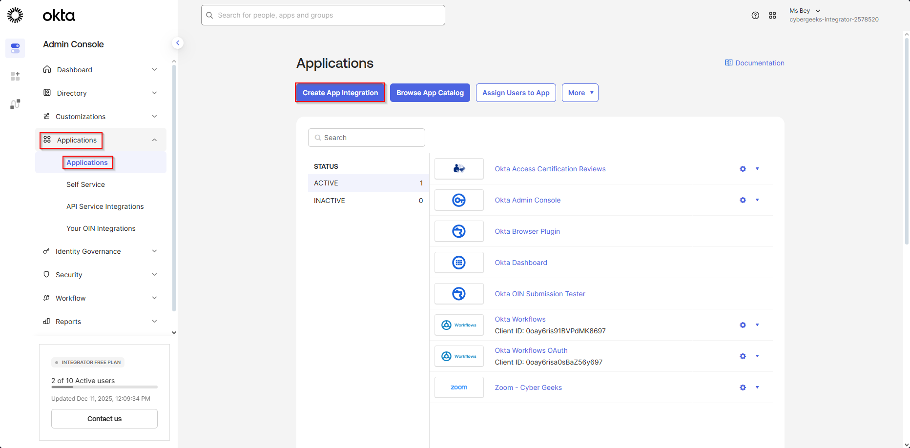

2. Select **SAML 2.0**, then click **Next**  
   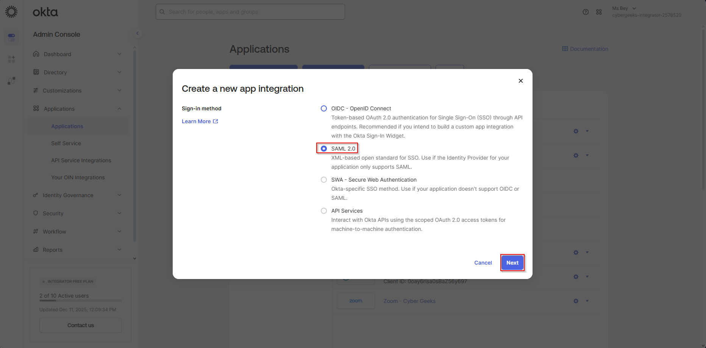

---

## 🔹 1.2 Enter General SAML App Settings

1. Enter the application name:  
   **App name:** `Test SAML App`  
   App logo: *Optional*  
2. Click **Next**  
   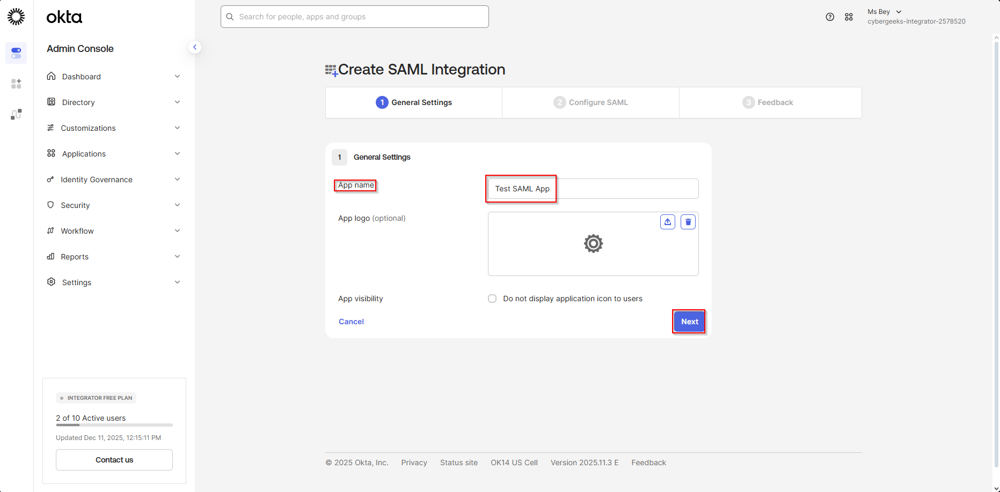

This defines the app as it appears within the Okta admin console and to end users in the Okta dashboard.

---

## 🔹 1.3 Configure Core SAML Settings

Enter the following test values:

- **Single sign on URL**  
  `https://example.com/saml/acs`  
  (The SP’s Assertion Consumer Service endpoint)

- **Audience URI (Entity ID)**  
  `https://example.com`

- **Name ID Format:** `EmailAddress`  
- **Application Username:** `Email`  

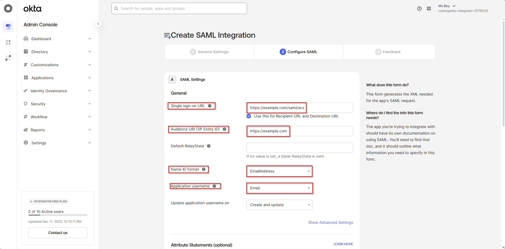

These values tell Okta **where to send the SAML Assertion** and how to identify the user.

---

## 🔹 1.4 Add SAML Attribute Statements

Attribute statements send user profile data to the Service Provider as part of the SAML assertion.

Add:

| Name      | Value            |
|-----------|------------------|
| firstName | user.firstName   |
| lastName  | user.lastName    |
| email     | user.email       |

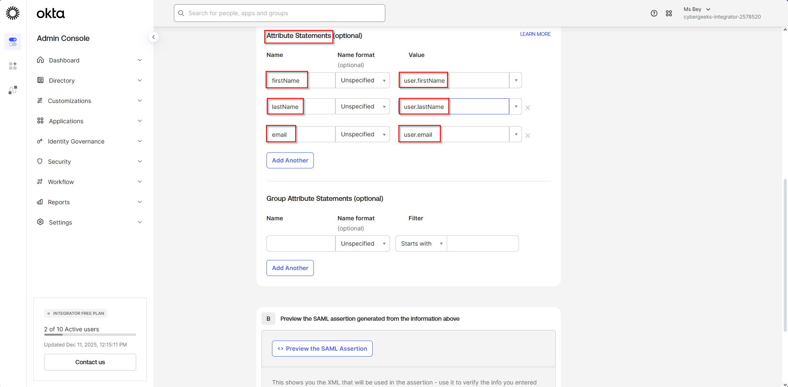  
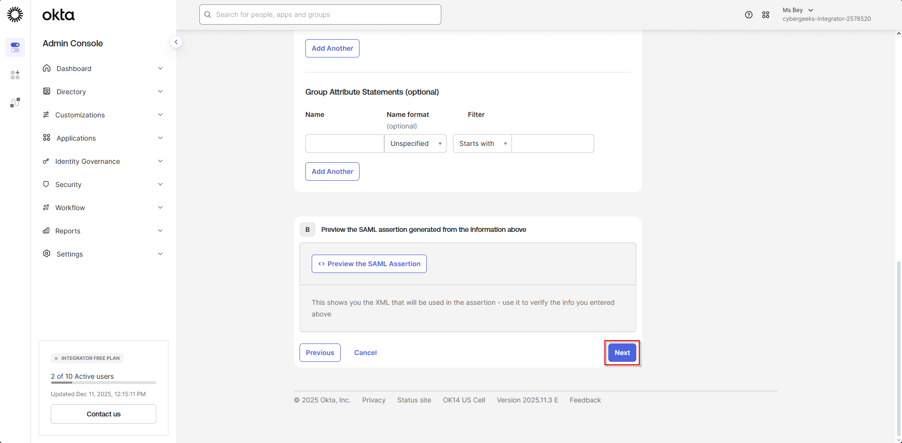

Scroll down and click **Next**.

---

## 🔹 1.5 Complete Setup

1. Under the **Feedback** section, choose **Finish**.  
   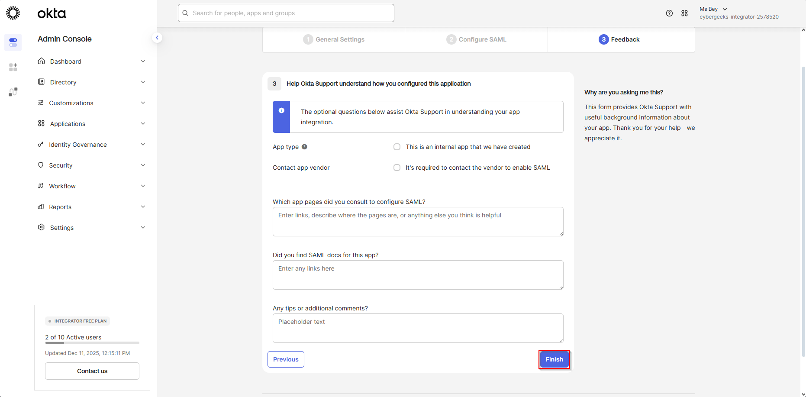

---

## 🔹 1.6 View Identity Provider Metadata

After finishing, click **View Setup Instructions**.  
This page contains the metadata you must provide to the Service Provider:

### **Key Items Shared With the Service Provider (SP)**

- **IdP Single Sign-On URL**  
- **IdP Entity ID**  
- **X.509 Certificate** (for signature validation)

These details allow the SP to trust Okta and complete the SAML handshake.

---

## 📘 **Real‑World Importance: Why SAML Configuration Matters**

SAML is one of the most widely used SSO standards in enterprise IAM.  
IAM analysts and engineers configure SAML apps when companies onboard:

- HR systems  
- Ticketing systems  
- Legacy apps  
- Vendor tools lacking OIDC support  

Being able to configure SAML manually demonstrates:

✔ Understanding of federation  
✔ Ability to troubleshoot SSO issues  
✔ Ability to map identity attributes  
✔ Knowledge of how authentication flows work behind the scenes  

Mastering this workflow is a core skill for enterprise IAM teams.

---

# 🟦 2. Configure an OIDC Application in Okta

OIDC is the modern authentication standard used for mobile apps, SPAs, APIs, and cloud‑native applications.

This lab walks through creating a basic OIDC client.

---

## 🔹 2.1 Start the OIDC App Integration

1. Navigate to **Applications → Create App Integration**  
   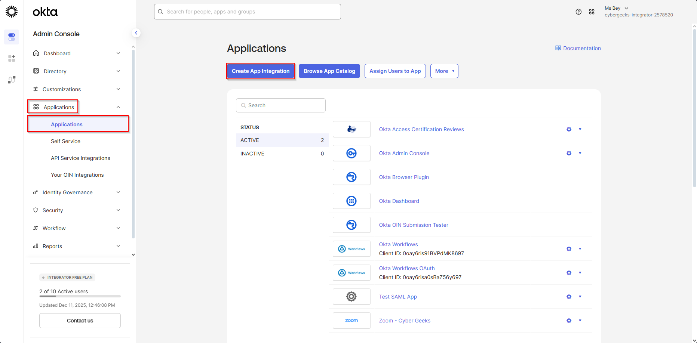

---

## 🔹 2.2 Select the OIDC Application Type

1. Choose **OIDC – OpenID Connect**  

2. Select an application type:

- **Web Application** – server‑side apps (Node, Django, .NET)  
- **Single-Page Application (SPA)** – React, Angular, Vue  
- **Native Application** – mobile apps  

3. Click **Next**  
   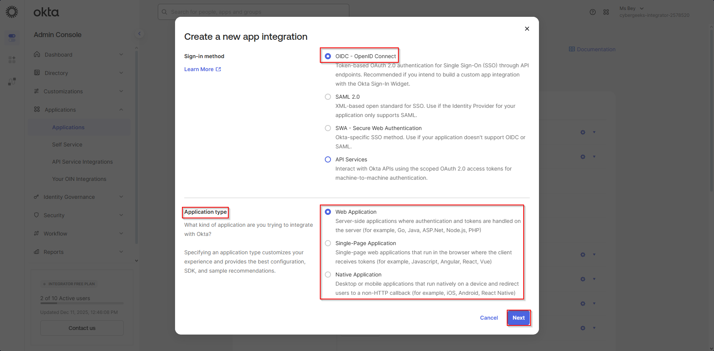

Choosing the correct app type guarantees the app receives the correct grant flow (Authorization Code, PKCE, etc.).

---

## 🔹 2.3 Configure the OIDC App Settings

Enter:

- **App integration name:** `Test OIDC App`  
- **Sign-in redirect URIs:**  
  `https://example.com/callback`  
- **Sign-out redirect URIs:**  
  `https://example.com`

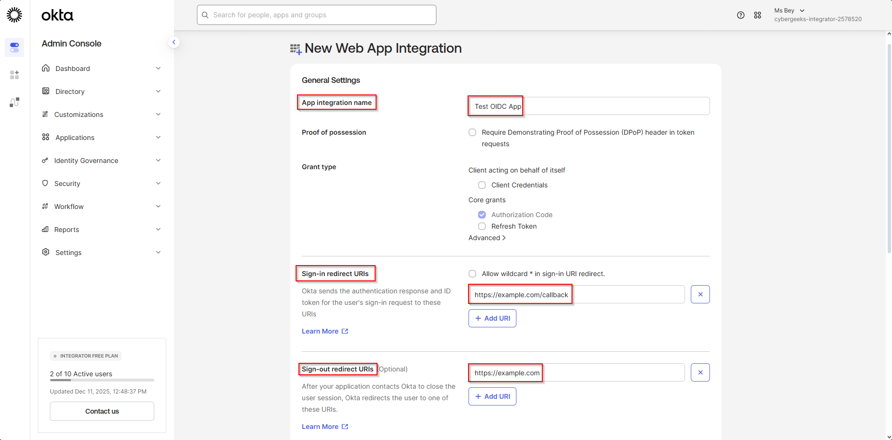

Redirect URIs define where Okta will return the authorization code or tokens after login.

---

## 🔹 2.4 Assign Access

1. Choose whether to allow access for all users or restrict to specific groups.  
2. Click **Save**.  
   

Assignments enforce **least privilege**—a fundamental security and compliance requirement.

---

## 🔹 2.5 Capture Client Credentials

After saving, Okta displays:

- **Client ID**  
- **Client Secret**  
- **Issuer URL**  
- **Discovery metadata**

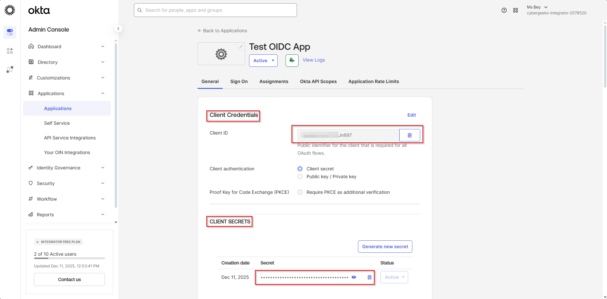

### ⚠️ Security Warning

- Never store the **Client Secret** in frontend JavaScript.  
- Never commit secrets to GitHub.  
- SPAs must use the **PKCE flow**, which does *not* require a client secret.

This is critical for preventing unauthorized token generation.

---

## 📘 **Real‑World Importance: Why OIDC Configuration Matters**

OIDC powers authentication for nearly all modern applications.  
IAM developers and analysts must understand:

✔ Token flows (Authorization Code, PKCE)  
✔ API authorization  
✔ Redirect URIs  
✔ How to provision secure application access  

OIDC is essential for:

- Cloud applications  
- Mobile authentication  
- API access (OAuth 2.0)  
- Zero Trust architectures  

Mastering OIDC demonstrates strong alignment with modern identity standards and engineering practices.

---

## 🔹 3 Assigning Access to the SAML-Based SSO Application

A critical part of onboarding any new SAML application in Okta is ensuring that **only the correct users or groups have access**.  
This enforces least‑privilege access control and ensures that only authorized users can authenticate through the new SSO integration.

Below are additional steps you can include in the lab to demonstrate **assigning access to designated user groups**.

---

### 🔸 3.1 Assign the SAML Application to Specific User Groups

1. After creating the SAML app, navigate to:  
   **Applications → Applications**  
   Next to your SAML app (**Test SAML App**), click the down arrow to the right of it and select **Assign to Groups**.  
   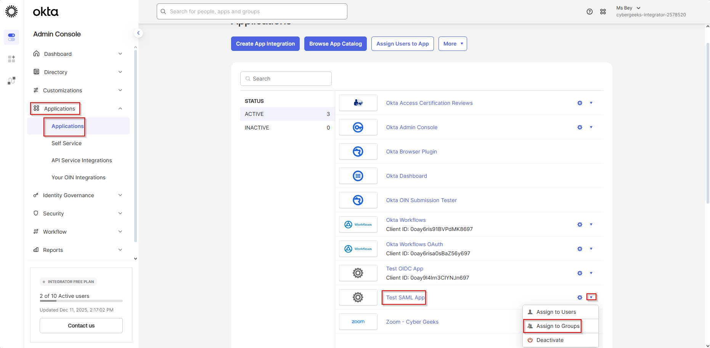

2. A modal will appear listing available Okta groups. Select the appropriate groups:  
   - **Engineering**  
   - **Everyone**  
   - **HR**  
   - Or any other group required by your business use case  

3. Click **Assign** next to each group.  
   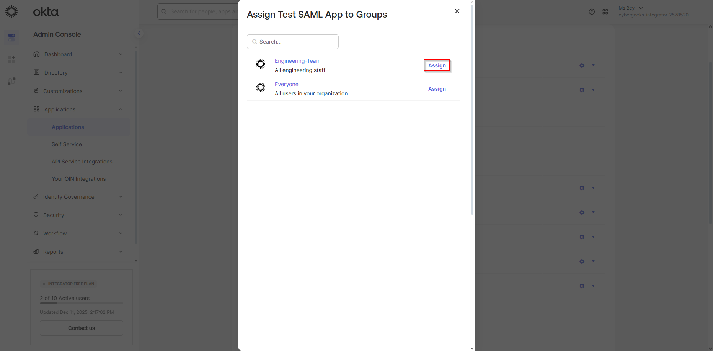  
   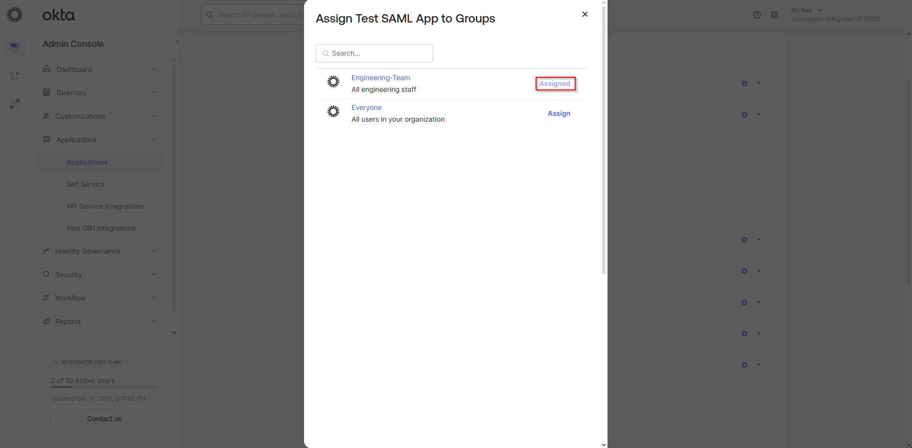

4. Scroll to the bottom of the page and click **Done**.  
   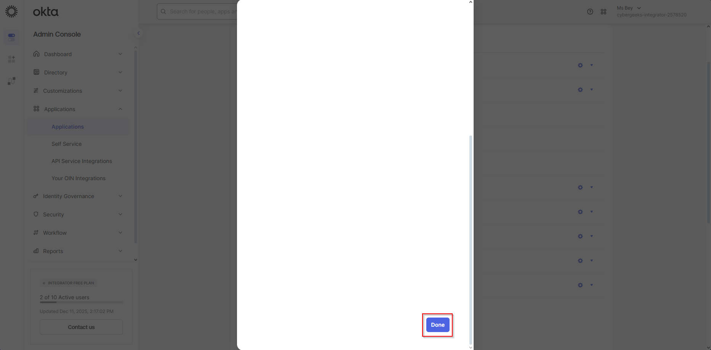

5. Navigate back to **Applications → Applications**, then click on **Test SAML App**.  
   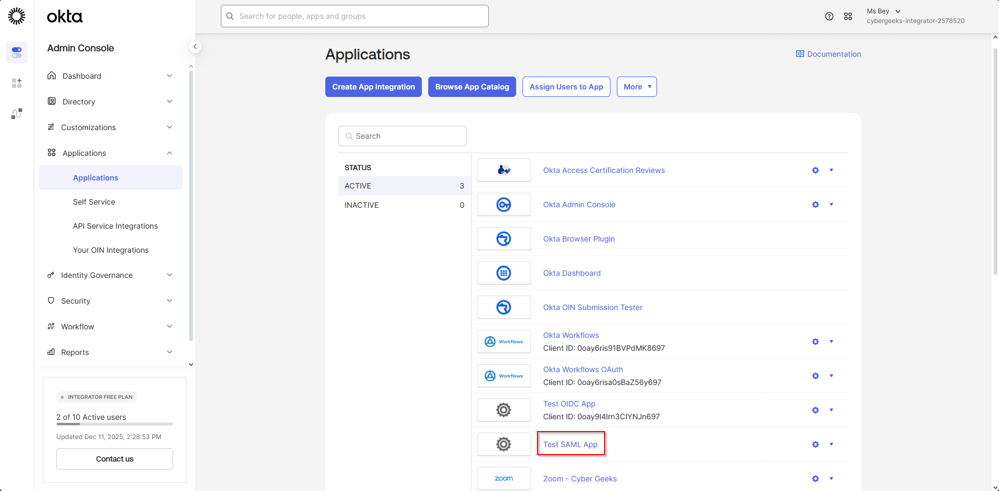

6. Under the **Filters** section, click on **Groups**.  
   The group(s) you selected should appear under the **Assignment** tab.  
   You should now see your chosen groups listed as having access to the application.  
   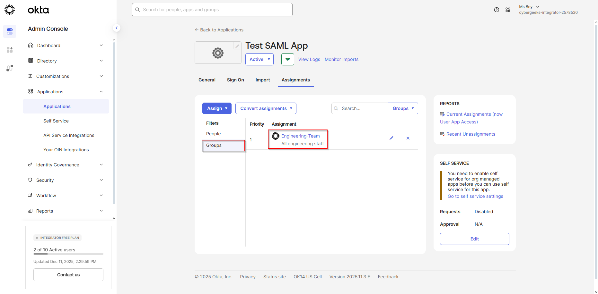

---

## 🔍 Real‑World Importance

Assigning group‑based access is essential for:

- Enforcing **RBAC (Role-Based Access Control)**  
- Preventing unauthorized users from accessing sensitive applications  
- Maintaining consistent access control across onboarding/offboarding cycles  
- Supporting audit requirements by demonstrating clearly defined access paths  

In real IAM environments, app assignments are aligned with:

- Job roles  
- HR-driven workflows  
- Identity lifecycle automation  
- Access governance (IGA) reviews  

Group‑based assignment ensures that application access is **predictable, auditable, and governed**, which is foundational to enterprise IAM operations.

---

## ✅ Conclusion

This lab provided practical experience configuring both SAML 2.0 and OIDC (OpenID Connect) applications in Okta—two of the most widely used identity federation standards in modern IAM. You walked through the complete lifecycle of onboarding a new application for Single Sign-On (SSO), including defining general app settings, configuring protocol‑specific parameters, mapping identity attributes, and generating metadata needed for service provider integrations.

On the SAML side, you configured assertion details, NameID formats, attribute statements, and reviewed IdP metadata components such as the Entity ID and X.509 certificate. For OIDC, you set redirect URIs, identified the correct app type, retrieved client credentials, and applied security best practices such as avoiding exposure of client secrets and understanding when PKCE is required.

By completing both configurations, you demonstrated core IAM engineering capabilities: integrating third‑party applications, establishing secure trust relationships, enabling standards‑based authentication flows, and aligning integrations with organizational identity governance. These skills reflect real‑world responsibilities of IAM analysts and engineers supporting enterprise SSO, identity federation, and secure authentication architectures.

---

**Author:** *Qadriyyah Abdullah [Ms Bey]*  
**Date:** *December 2025*  
**Tags:** `Okta` `SAML` `OIDC` `SSO` `IdentityFederation` `IAM`
